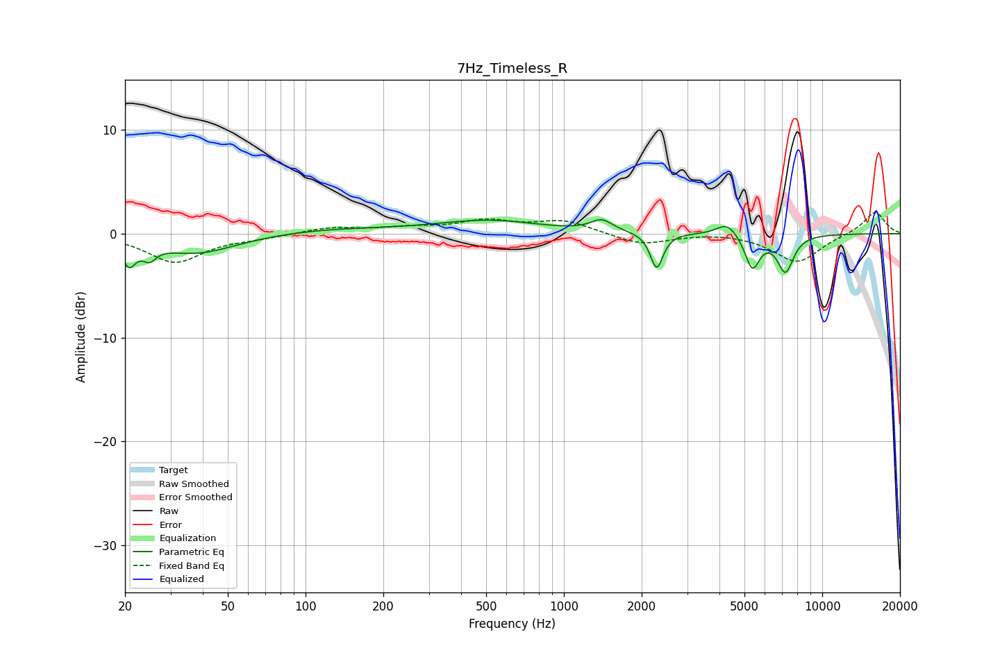

# 7Hz_Timeless_R
See [usage instructions](https://github.com/jaakkopasanen/AutoEq#usage) for more options and info.

### Parametric EQs
Apply preamp of -1.4 dB when using parametric equalizer.

|   # | Type    |   Fc (Hz) |    Q |   Gain (dB) |
|-----|---------|-----------|------|-------------|
|   1 | Peaking |        21 | 5.37 |        -2.3 |
|   2 | Peaking |        25 | 5.48 |        -1.2 |
|   3 | Peaking |        38 | 0.93 |        -1.9 |
|   4 | Peaking |       128 | 0.58 |         0.4 |
|   5 | Peaking |       510 | 0.71 |         1.2 |
|   6 | Peaking |      1400 | 3.34 |         1.1 |
|   7 | Peaking |      2286 | 5.9  |        -3.4 |
|   8 | Peaking |      4290 | 3.46 |         1.3 |
|   9 | Peaking |      5365 | 4.91 |        -3.3 |
|  10 | Peaking |      7201 | 4.3  |        -3.5 |

### Fixed Band EQs
When using fixed band (also called graphic) equalizer, apply preamp of **-2.1 dB** (if available) and set gains manually with these parameters.

|   # | Type    |   Fc (Hz) |    Q |   Gain (dB) |
|-----|---------|-----------|------|-------------|
|   1 | Peaking |        31 | 1.41 |        -2.7 |
|   2 | Peaking |        62 | 1.41 |        -0.3 |
|   3 | Peaking |       125 | 1.41 |         0.6 |
|   4 | Peaking |       250 | 1.41 |         0.5 |
|   5 | Peaking |       500 | 1.41 |         1.1 |
|   6 | Peaking |      1000 | 1.41 |         1.2 |
|   7 | Peaking |      2000 | 1.41 |        -1.1 |
|   8 | Peaking |      4000 | 1.41 |         0.2 |
|   9 | Peaking |      8000 | 1.41 |        -2.8 |
|  10 | Peaking |     16000 | 1.41 |         2.2 |

### Graphs

