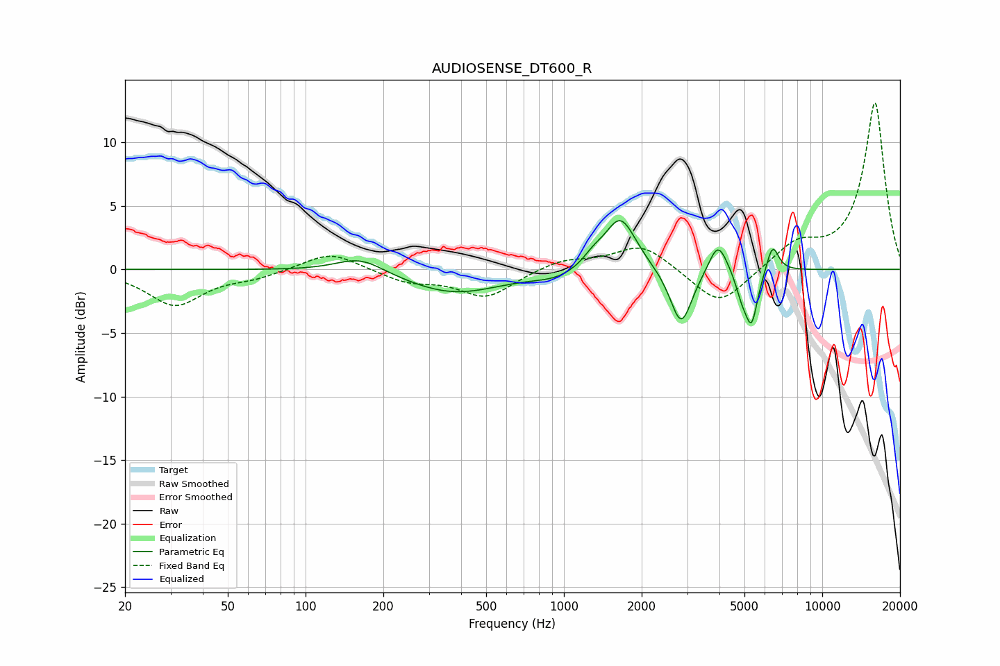

# AUDIOSENSE_DT600_R
See [usage instructions](https://github.com/jaakkopasanen/AutoEq#usage) for more options and info.

### Parametric EQs
Apply preamp of -3.9 dB when using parametric equalizer.

|   # | Type    |   Fc (Hz) |    Q |   Gain (dB) |
|-----|---------|-----------|------|-------------|
|   1 | Peaking |       163 | 1.5  |         1.3 |
|   2 | Peaking |       375 | 0.75 |        -1.9 |
|   3 | Peaking |       939 | 1.6  |        -0.6 |
|   4 | Peaking |      1299 | 3.59 |         0.7 |
|   5 | Peaking |      1654 | 2.31 |         4.2 |
|   6 | Peaking |      2842 | 3.32 |        -4.6 |
|   7 | Peaking |      3949 | 3.96 |         2.5 |
|   8 | Peaking |      4871 | 6    |        -1.4 |
|   9 | Peaking |      5323 | 5.7  |        -4.1 |
|  10 | Peaking |      6423 | 5.92 |         2.2 |

### Fixed Band EQs
When using fixed band (also called graphic) equalizer, apply preamp of **-13.2 dB** (if available) and set gains manually with these parameters.

|   # | Type    |   Fc (Hz) |    Q |   Gain (dB) |
|-----|---------|-----------|------|-------------|
|   1 | Peaking |        31 | 1.41 |        -2.8 |
|   2 | Peaking |        62 | 1.41 |        -0.5 |
|   3 | Peaking |       125 | 1.41 |         1.5 |
|   4 | Peaking |       250 | 1.41 |        -0.9 |
|   5 | Peaking |       500 | 1.41 |        -2.2 |
|   6 | Peaking |      1000 | 1.41 |         0.8 |
|   7 | Peaking |      2000 | 1.41 |         2   |
|   8 | Peaking |      4000 | 1.41 |        -3   |
|   9 | Peaking |      8000 | 1.41 |         1.9 |
|  10 | Peaking |     16000 | 1.41 |        13.1 |

### Graphs

