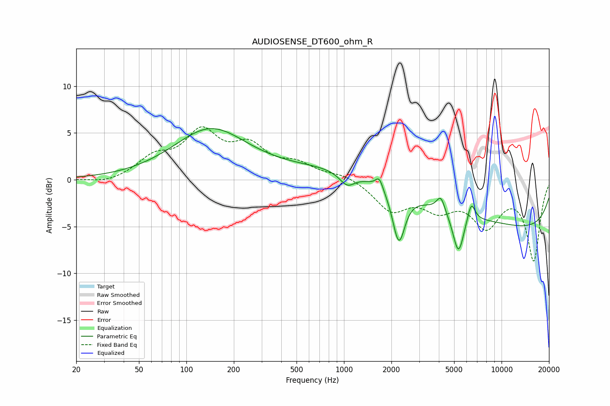

# AUDIOSENSE_DT600_ohm_R
See [usage instructions](https://github.com/jaakkopasanen/AutoEq#usage) for more options and info.

### Parametric EQs
Apply preamp of -5.6 dB when using parametric equalizer.

|   # | Type    |   Fc (Hz) |    Q |   Gain (dB) |
|-----|---------|-----------|------|-------------|
|   1 | Peaking |       142 | 0.61 |         5.3 |
|   2 | Peaking |      1048 | 2.88 |        -1.4 |
|   3 | Peaking |      1675 | 5.96 |         1.3 |
|   4 | Peaking |      2221 | 3.71 |        -4.8 |
|   5 | Peaking |      2274 | 3.89 |        -0.7 |
|   6 | Peaking |      2502 | 0.18 |         2.1 |
|   7 | Peaking |      4116 | 5.36 |         1.7 |
|   8 | Peaking |      5325 | 3.99 |        -4.4 |
|   9 | Peaking |      6423 | 5.62 |         2.1 |
|  10 | Peaking |      9891 | 0.18 |        -5.8 |

### Fixed Band EQs
When using fixed band (also called graphic) equalizer, apply preamp of **-5.8 dB** (if available) and set gains manually with these parameters.

|   # | Type    |   Fc (Hz) |    Q |   Gain (dB) |
|-----|---------|-----------|------|-------------|
|   1 | Peaking |        31 | 1.41 |        -0.5 |
|   2 | Peaking |        62 | 1.41 |         2.1 |
|   3 | Peaking |       125 | 1.41 |         4.7 |
|   4 | Peaking |       250 | 1.41 |         3.1 |
|   5 | Peaking |       500 | 1.41 |         1.4 |
|   6 | Peaking |      1000 | 1.41 |         0.6 |
|   7 | Peaking |      2000 | 1.41 |        -3.1 |
|   8 | Peaking |      4000 | 1.41 |        -2.6 |
|   9 | Peaking |      8000 | 1.41 |        -4.5 |
|  10 | Peaking |     16000 | 1.41 |        -8.5 |

### Graphs

