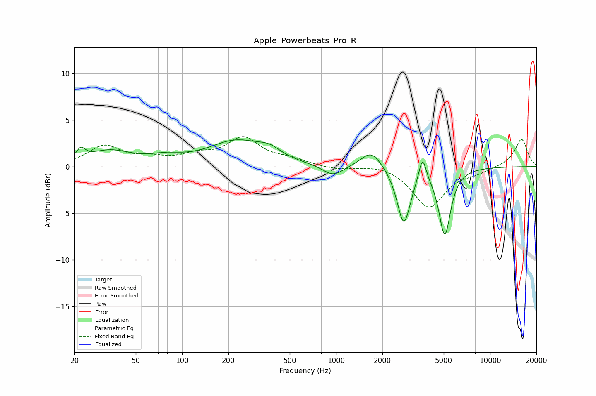

# Apple_Powerbeats_Pro_R
See [usage instructions](https://github.com/jaakkopasanen/AutoEq#usage) for more options and info.

### Parametric EQs
Apply preamp of -3.0 dB when using parametric equalizer.

|   # | Type    |   Fc (Hz) |    Q |   Gain (dB) |
|-----|---------|-----------|------|-------------|
|   1 | Peaking |        22 | 5.11 |         1.1 |
|   2 | Peaking |        34 | 1.02 |         1.6 |
|   3 | Peaking |        79 | 1.26 |         0.7 |
|   4 | Peaking |       225 | 0.8  |         2.6 |
|   5 | Peaking |       369 | 1.91 |         0.9 |
|   6 | Peaking |       955 | 2.12 |        -1.2 |
|   7 | Peaking |      1696 | 2.15 |         1.9 |
|   8 | Peaking |      2753 | 3.25 |        -6.1 |
|   9 | Peaking |      3641 | 5.99 |         2.7 |
|  10 | Peaking |      5080 | 3.66 |        -7.2 |

### Fixed Band EQs
When using fixed band (also called graphic) equalizer, apply preamp of **-3.3 dB** (if available) and set gains manually with these parameters.

|   # | Type    |   Fc (Hz) |    Q |   Gain (dB) |
|-----|---------|-----------|------|-------------|
|   1 | Peaking |        31 | 1.41 |         2.1 |
|   2 | Peaking |        62 | 1.41 |         0.7 |
|   3 | Peaking |       125 | 1.41 |         1   |
|   4 | Peaking |       250 | 1.41 |         2.9 |
|   5 | Peaking |       500 | 1.41 |         0.6 |
|   6 | Peaking |      1000 | 1.41 |        -0.3 |
|   7 | Peaking |      2000 | 1.41 |         0.4 |
|   8 | Peaking |      4000 | 1.41 |        -4.4 |
|   9 | Peaking |      8000 | 1.41 |        -0.5 |
|  10 | Peaking |     16000 | 1.41 |         3   |

### Graphs

