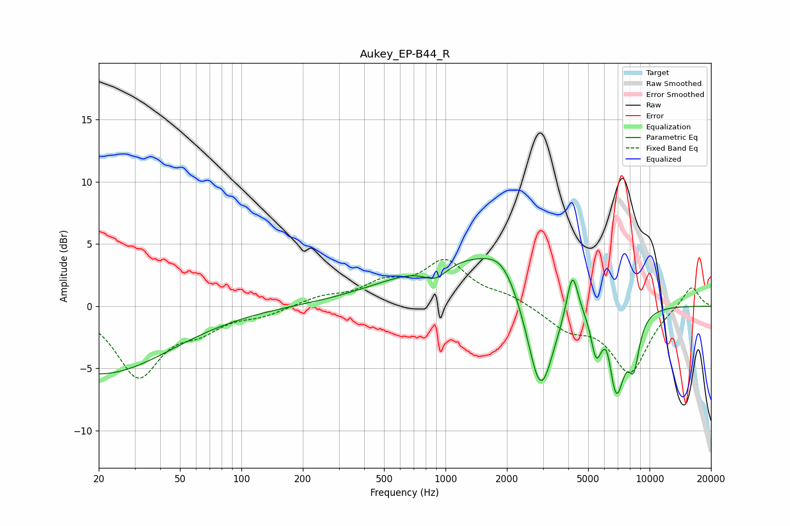

# Aukey_EP-B44_R
See [usage instructions](https://github.com/jaakkopasanen/AutoEq#usage) for more options and info.

### Parametric EQs
Apply preamp of -3.9 dB when using parametric equalizer.

|   # | Type    |   Fc (Hz) |    Q |   Gain (dB) |
|-----|---------|-----------|------|-------------|
|   1 | Peaking |        20 | 0.4  |        -5.4 |
|   2 | Peaking |       895 | 2.22 |        -1.3 |
|   3 | Peaking |      1447 | 0.38 |         4.4 |
|   4 | Peaking |      1902 | 1.82 |         1.5 |
|   5 | Peaking |      2920 | 1.96 |        -9.6 |
|   6 | Peaking |      4187 | 5.13 |         3.7 |
|   7 | Peaking |      5467 | 5.6  |        -3   |
|   8 | Peaking |      6220 | 5.97 |         1.4 |
|   9 | Peaking |      6856 | 3.13 |        -7.1 |
|  10 | Peaking |      8374 | 4.72 |        -3.5 |

### Fixed Band EQs
When using fixed band (also called graphic) equalizer, apply preamp of **-3.8 dB** (if available) and set gains manually with these parameters.

|   # | Type    |   Fc (Hz) |    Q |   Gain (dB) |
|-----|---------|-----------|------|-------------|
|   1 | Peaking |        31 | 1.41 |        -5.5 |
|   2 | Peaking |        62 | 1.41 |        -1.5 |
|   3 | Peaking |       125 | 1.41 |        -0.6 |
|   4 | Peaking |       250 | 1.41 |         0.7 |
|   5 | Peaking |       500 | 1.41 |         1.6 |
|   6 | Peaking |      1000 | 1.41 |         3.4 |
|   7 | Peaking |      2000 | 1.41 |         0.7 |
|   8 | Peaking |      4000 | 1.41 |        -1.6 |
|   9 | Peaking |      8000 | 1.41 |        -5.2 |
|  10 | Peaking |     16000 | 1.41 |         1.8 |

### Graphs

