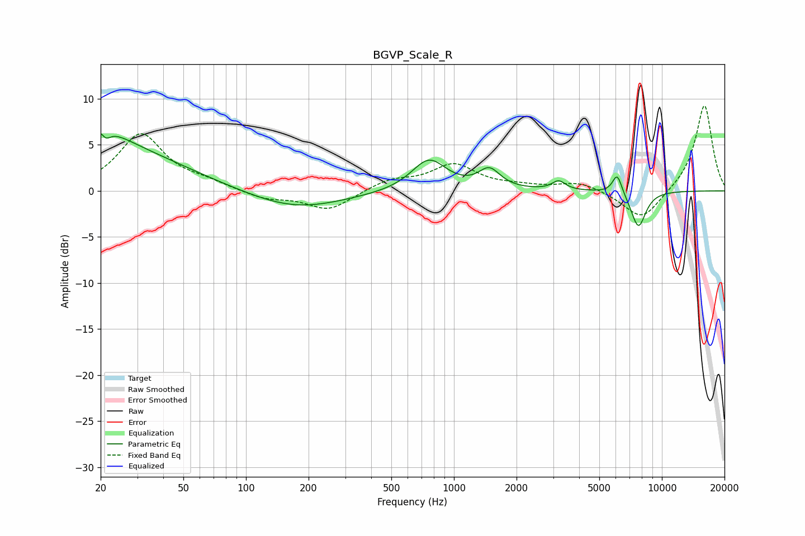

# BGVP_Scale_R
See [usage instructions](https://github.com/jaakkopasanen/AutoEq#usage) for more options and info.

### Parametric EQs
Apply preamp of -6.3 dB when using parametric equalizer.

|   # | Type    |   Fc (Hz) |    Q |   Gain (dB) |
|-----|---------|-----------|------|-------------|
|   1 | Peaking |        21 | 5.89 |         3.2 |
|   2 | Peaking |        21 | 5.97 |        -3.5 |
|   3 | Peaking |        21 | 1.36 |         1.9 |
|   4 | Peaking |        22 | 0.41 |         4.5 |
|   5 | Peaking |       173 | 0.61 |        -2   |
|   6 | Peaking |       758 | 1.71 |         3.4 |
|   7 | Peaking |      1480 | 2.76 |         2.1 |
|   8 | Peaking |      3190 | 4.54 |         1   |
|   9 | Peaking |      6100 | 6    |         2.2 |
|  10 | Peaking |      7708 | 3.71 |        -4   |

### Fixed Band EQs
When using fixed band (also called graphic) equalizer, apply preamp of **-9.3 dB** (if available) and set gains manually with these parameters.

|   # | Type    |   Fc (Hz) |    Q |   Gain (dB) |
|-----|---------|-----------|------|-------------|
|   1 | Peaking |        31 | 1.41 |         6.1 |
|   2 | Peaking |        62 | 1.41 |         0.7 |
|   3 | Peaking |       125 | 1.41 |        -0.9 |
|   4 | Peaking |       250 | 1.41 |        -2.1 |
|   5 | Peaking |       500 | 1.41 |         1.1 |
|   6 | Peaking |      1000 | 1.41 |         2.7 |
|   7 | Peaking |      2000 | 1.41 |         0.4 |
|   8 | Peaking |      4000 | 1.41 |         1   |
|   9 | Peaking |      8000 | 1.41 |        -3.3 |
|  10 | Peaking |     16000 | 1.41 |         9.4 |

### Graphs

