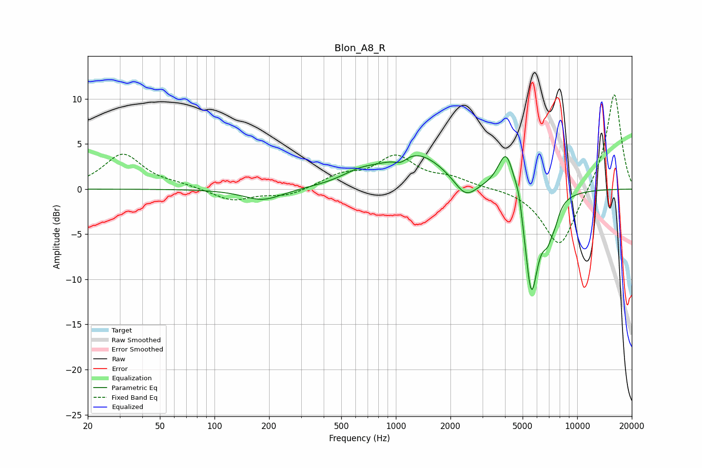

# Blon_A8_R
See [usage instructions](https://github.com/jaakkopasanen/AutoEq#usage) for more options and info.

### Parametric EQs
Apply preamp of -3.8 dB when using parametric equalizer.

|   # | Type    |   Fc (Hz) |    Q |   Gain (dB) |
|-----|---------|-----------|------|-------------|
|   1 | Peaking |       185 | 1.33 |        -1.3 |
|   2 | Peaking |       630 | 1.38 |         1   |
|   3 | Peaking |      1065 | 3.93 |        -0.8 |
|   4 | Peaking |      1284 | 0.85 |         4   |
|   5 | Peaking |      2421 | 2.27 |        -2.2 |
|   6 | Peaking |      4077 | 3.01 |         5.2 |
|   7 | Peaking |      4770 | 6    |         1.9 |
|   8 | Peaking |      5582 | 3.35 |       -12   |
|   9 | Peaking |      6887 | 4.25 |        -3   |
|  10 | Peaking |      7574 | 6    |        -1   |

### Fixed Band EQs
When using fixed band (also called graphic) equalizer, apply preamp of **-10.6 dB** (if available) and set gains manually with these parameters.

|   # | Type    |   Fc (Hz) |    Q |   Gain (dB) |
|-----|---------|-----------|------|-------------|
|   1 | Peaking |        31 | 1.41 |         3.8 |
|   2 | Peaking |        62 | 1.41 |         0.4 |
|   3 | Peaking |       125 | 1.41 |        -1.3 |
|   4 | Peaking |       250 | 1.41 |        -0.8 |
|   5 | Peaking |       500 | 1.41 |         1.4 |
|   6 | Peaking |      1000 | 1.41 |         3.4 |
|   7 | Peaking |      2000 | 1.41 |         1   |
|   8 | Peaking |      4000 | 1.41 |         0.1 |
|   9 | Peaking |      8000 | 1.41 |        -6.7 |
|  10 | Peaking |     16000 | 1.41 |        10.9 |

### Graphs

