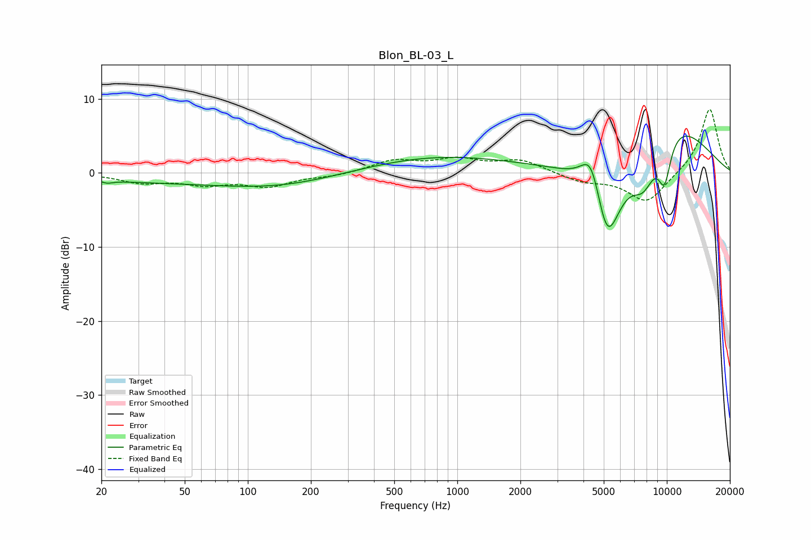

# Blon_BL-03_L
See [usage instructions](https://github.com/jaakkopasanen/AutoEq#usage) for more options and info.

### Parametric EQs
Apply preamp of -5.1 dB when using parametric equalizer.

|   # | Type    |   Fc (Hz) |    Q |   Gain (dB) |
|-----|---------|-----------|------|-------------|
|   1 | Peaking |        21 | 5.35 |        -0.4 |
|   2 | Peaking |        27 | 2.26 |        -0   |
|   3 | Peaking |        81 | 0.19 |        -1.4 |
|   4 | Peaking |       140 | 0.57 |        -0.8 |
|   5 | Peaking |       760 | 0.37 |         2.4 |
|   6 | Peaking |      4362 | 2.76 |         6   |
|   7 | Peaking |      5184 | 1.87 |       -12.9 |
|   8 | Peaking |      7741 | 2.11 |        -5.4 |
|   9 | Peaking |      9748 | 3.85 |        -6.1 |
|  10 | Peaking |     10000 | 0.57 |         7.8 |

### Fixed Band EQs
When using fixed band (also called graphic) equalizer, apply preamp of **-8.7 dB** (if available) and set gains manually with these parameters.

|   # | Type    |   Fc (Hz) |    Q |   Gain (dB) |
|-----|---------|-----------|------|-------------|
|   1 | Peaking |        31 | 1.41 |        -1.2 |
|   2 | Peaking |        62 | 1.41 |        -1.3 |
|   3 | Peaking |       125 | 1.41 |        -1.7 |
|   4 | Peaking |       250 | 1.41 |        -0.4 |
|   5 | Peaking |       500 | 1.41 |         1.6 |
|   6 | Peaking |      1000 | 1.41 |         1.6 |
|   7 | Peaking |      2000 | 1.41 |         1.7 |
|   8 | Peaking |      4000 | 1.41 |        -1.1 |
|   9 | Peaking |      8000 | 1.41 |        -4.1 |
|  10 | Peaking |     16000 | 1.41 |         8.8 |

### Graphs

