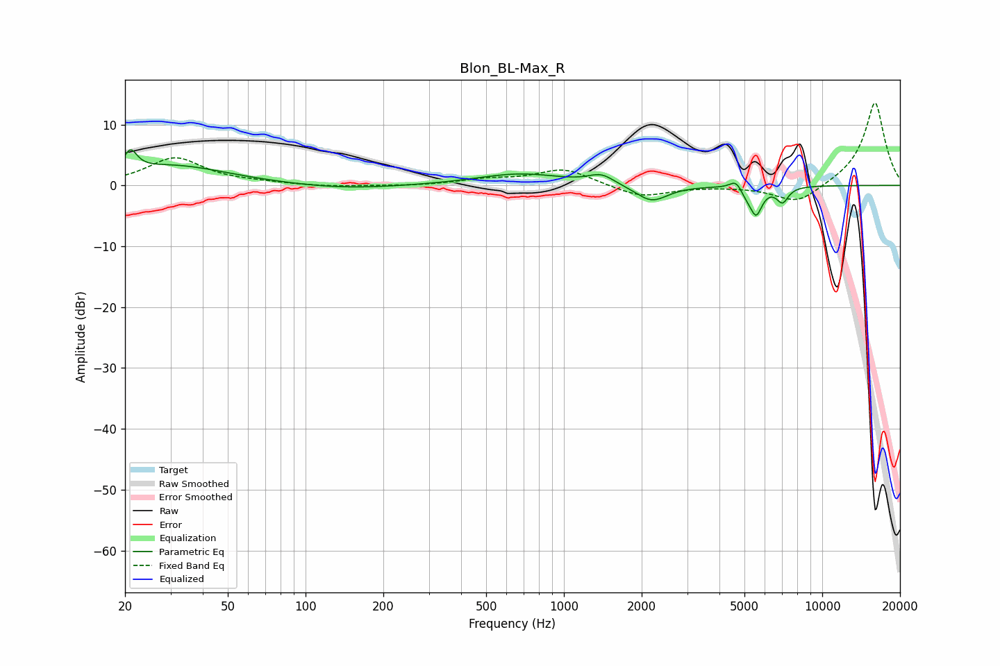

# Blon_BL-Max_R
See [usage instructions](https://github.com/jaakkopasanen/AutoEq#usage) for more options and info.

### Parametric EQs
Apply preamp of -5.9 dB when using parametric equalizer.

|   # | Type    |   Fc (Hz) |    Q |   Gain (dB) |
|-----|---------|-----------|------|-------------|
|   1 | Peaking |        21 | 5.72 |         3.3 |
|   2 | Peaking |        30 | 0.65 |         3.3 |
|   3 | Peaking |       142 | 0.7  |        -0.7 |
|   4 | Peaking |       676 | 0.84 |         1.9 |
|   5 | Peaking |      1397 | 2.89 |         1.6 |
|   6 | Peaking |      2186 | 2.26 |        -2.8 |
|   7 | Peaking |      4637 | 5.95 |         1.5 |
|   8 | Peaking |      5084 | 6    |        -1.1 |
|   9 | Peaking |      5547 | 6    |        -4.4 |
|  10 | Peaking |      7018 | 6    |        -2.5 |

### Fixed Band EQs
When using fixed band (also called graphic) equalizer, apply preamp of **-13.6 dB** (if available) and set gains manually with these parameters.

|   # | Type    |   Fc (Hz) |    Q |   Gain (dB) |
|-----|---------|-----------|------|-------------|
|   1 | Peaking |        31 | 1.41 |         4.5 |
|   2 | Peaking |        62 | 1.41 |         0.3 |
|   3 | Peaking |       125 | 1.41 |        -0.3 |
|   4 | Peaking |       250 | 1.41 |        -0.1 |
|   5 | Peaking |       500 | 1.41 |         0.9 |
|   6 | Peaking |      1000 | 1.41 |         2.7 |
|   7 | Peaking |      2000 | 1.41 |        -2   |
|   8 | Peaking |      4000 | 1.41 |        -0.1 |
|   9 | Peaking |      8000 | 1.41 |        -3.2 |
|  10 | Peaking |     16000 | 1.41 |        13.8 |

### Graphs

