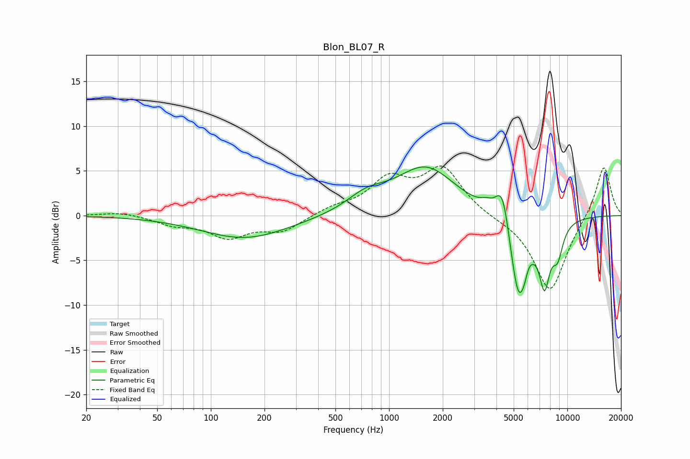

# Blon_BL07_R
See [usage instructions](https://github.com/jaakkopasanen/AutoEq#usage) for more options and info.

### Parametric EQs
Apply preamp of -5.5 dB when using parametric equalizer.

|   # | Type    |   Fc (Hz) |    Q |   Gain (dB) |
|-----|---------|-----------|------|-------------|
|   1 | Peaking |       156 | 0.58 |        -2.6 |
|   2 | Peaking |       744 | 1.3  |         1.7 |
|   3 | Peaking |      1608 | 0.84 |         5.3 |
|   4 | Peaking |      3506 | 4.15 |         0.6 |
|   5 | Peaking |      4336 | 3.38 |         5.1 |
|   6 | Peaking |      5324 | 2.55 |       -10.1 |
|   7 | Peaking |      5877 | 5.89 |        -1.8 |
|   8 | Peaking |      5971 | 5.99 |         2.1 |
|   9 | Peaking |      7448 | 4.45 |        -6.1 |
|  10 | Peaking |      8816 | 4.16 |        -3.3 |

### Fixed Band EQs
When using fixed band (also called graphic) equalizer, apply preamp of **-5.6 dB** (if available) and set gains manually with these parameters.

|   # | Type    |   Fc (Hz) |    Q |   Gain (dB) |
|-----|---------|-----------|------|-------------|
|   1 | Peaking |        31 | 1.41 |         0.4 |
|   2 | Peaking |        62 | 1.41 |        -0.9 |
|   3 | Peaking |       125 | 1.41 |        -2.3 |
|   4 | Peaking |       250 | 1.41 |        -1.7 |
|   5 | Peaking |       500 | 1.41 |         0.8 |
|   6 | Peaking |      1000 | 1.41 |         3.7 |
|   7 | Peaking |      2000 | 1.41 |         5.1 |
|   8 | Peaking |      4000 | 1.41 |        -0.2 |
|   9 | Peaking |      8000 | 1.41 |        -8.6 |
|  10 | Peaking |     16000 | 1.41 |         5.8 |

### Graphs

