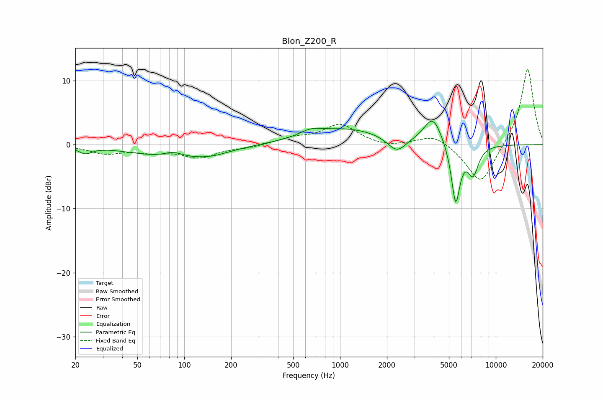

# Blon_Z200_R
See [usage instructions](https://github.com/jaakkopasanen/AutoEq#usage) for more options and info.

### Parametric EQs
Apply preamp of -3.8 dB when using parametric equalizer.

|   # | Type    |   Fc (Hz) |    Q |   Gain (dB) |
|-----|---------|-----------|------|-------------|
|   1 | Peaking |        23 | 3.38 |        -1   |
|   2 | Peaking |        83 | 0.58 |        -1.9 |
|   3 | Peaking |        85 | 2.48 |         0.9 |
|   4 | Peaking |       150 | 1.2  |        -0.8 |
|   5 | Peaking |       647 | 2.07 |         0.9 |
|   6 | Peaking |      1100 | 0.59 |         2.4 |
|   7 | Peaking |      2315 | 2.4  |        -2.3 |
|   8 | Peaking |      3943 | 2.42 |         4.3 |
|   9 | Peaking |      5526 | 4.85 |        -9.4 |
|  10 | Peaking |      7144 | 3.84 |        -4.3 |

### Fixed Band EQs
When using fixed band (also called graphic) equalizer, apply preamp of **-11.9 dB** (if available) and set gains manually with these parameters.

|   # | Type    |   Fc (Hz) |    Q |   Gain (dB) |
|-----|---------|-----------|------|-------------|
|   1 | Peaking |        31 | 1.41 |        -1.3 |
|   2 | Peaking |        62 | 1.41 |        -0.9 |
|   3 | Peaking |       125 | 1.41 |        -1.9 |
|   4 | Peaking |       250 | 1.41 |        -0.4 |
|   5 | Peaking |       500 | 1.41 |         0.9 |
|   6 | Peaking |      1000 | 1.41 |         3.1 |
|   7 | Peaking |      2000 | 1.41 |        -0.5 |
|   8 | Peaking |      4000 | 1.41 |         1.7 |
|   9 | Peaking |      8000 | 1.41 |        -6.4 |
|  10 | Peaking |     16000 | 1.41 |        12.2 |

### Graphs

