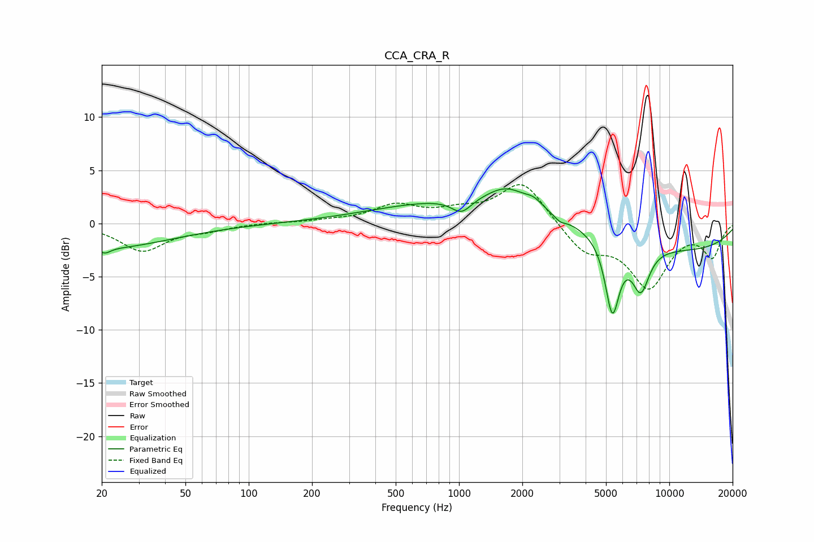

# CCA_CRA_R
See [usage instructions](https://github.com/jaakkopasanen/AutoEq#usage) for more options and info.

### Parametric EQs
Apply preamp of -3.3 dB when using parametric equalizer.

|   # | Type    |   Fc (Hz) |    Q |   Gain (dB) |
|-----|---------|-----------|------|-------------|
|   1 | Peaking |        20 | 0.44 |        -2.3 |
|   2 | Peaking |        21 | 5.63 |        -0.5 |
|   3 | Peaking |      1028 | 2.94 |        -1.4 |
|   4 | Peaking |      1493 | 0.26 |         2.5 |
|   5 | Peaking |      1694 | 1.52 |         1.7 |
|   6 | Peaking |      2267 | 3.72 |         0.6 |
|   7 | Peaking |      3021 | 5.29 |        -0.5 |
|   8 | Peaking |      5358 | 4.08 |        -6.9 |
|   9 | Peaking |      7316 | 3.21 |        -4.1 |
|  10 | Peaking |      9485 | 0.23 |        -2.7 |

### Fixed Band EQs
When using fixed band (also called graphic) equalizer, apply preamp of **-3.7 dB** (if available) and set gains manually with these parameters.

|   # | Type    |   Fc (Hz) |    Q |   Gain (dB) |
|-----|---------|-----------|------|-------------|
|   1 | Peaking |        31 | 1.41 |        -2.5 |
|   2 | Peaking |        62 | 1.41 |        -0.5 |
|   3 | Peaking |       125 | 1.41 |         0.1 |
|   4 | Peaking |       250 | 1.41 |         0.2 |
|   5 | Peaking |       500 | 1.41 |         1.6 |
|   6 | Peaking |      1000 | 1.41 |         0.9 |
|   7 | Peaking |      2000 | 1.41 |         4   |
|   8 | Peaking |      4000 | 1.41 |        -2.6 |
|   9 | Peaking |      8000 | 1.41 |        -5.8 |
|  10 | Peaking |     16000 | 1.41 |        -3   |

### Graphs

