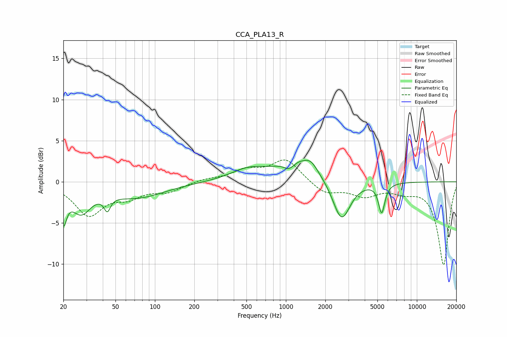

# CCA_PLA13_R
See [usage instructions](https://github.com/jaakkopasanen/AutoEq#usage) for more options and info.

### Parametric EQs
Apply preamp of -2.7 dB when using parametric equalizer.

|   # | Type    |   Fc (Hz) |    Q |   Gain (dB) |
|-----|---------|-----------|------|-------------|
|   1 | Peaking |        20 | 5.96 |        -3.8 |
|   2 | Peaking |        27 | 1.88 |        -3.2 |
|   3 | Peaking |        43 | 5.98 |        -1.7 |
|   4 | Peaking |        73 | 0.67 |        -1.8 |
|   5 | Peaking |       516 | 1.04 |         1.3 |
|   6 | Peaking |      1061 | 3.4  |        -1   |
|   7 | Peaking |      1257 | 0.94 |         2.7 |
|   8 | Peaking |      1558 | 3.07 |         0.9 |
|   9 | Peaking |      2657 | 2.11 |        -5.1 |
|  10 | Peaking |      5386 | 5.91 |        -3.6 |

### Fixed Band EQs
When using fixed band (also called graphic) equalizer, apply preamp of **-2.8 dB** (if available) and set gains manually with these parameters.

|   # | Type    |   Fc (Hz) |    Q |   Gain (dB) |
|-----|---------|-----------|------|-------------|
|   1 | Peaking |        31 | 1.41 |        -3.9 |
|   2 | Peaking |        62 | 1.41 |        -1.5 |
|   3 | Peaking |       125 | 1.41 |        -1.1 |
|   4 | Peaking |       250 | 1.41 |         0.3 |
|   5 | Peaking |       500 | 1.41 |         1.3 |
|   6 | Peaking |      1000 | 1.41 |         2.7 |
|   7 | Peaking |      2000 | 1.41 |        -1.5 |
|   8 | Peaking |      4000 | 1.41 |        -1.5 |
|   9 | Peaking |      8000 | 1.41 |        -0.9 |
|  10 | Peaking |     16000 | 1.41 |       -10.1 |

### Graphs

