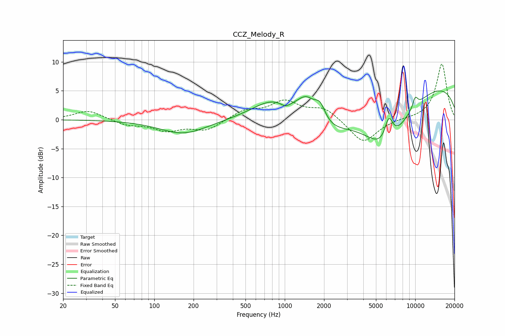

# CCZ_Melody_R
See [usage instructions](https://github.com/jaakkopasanen/AutoEq#usage) for more options and info.

### Parametric EQs
Apply preamp of -5.1 dB when using parametric equalizer.

|   # | Type    |   Fc (Hz) |    Q |   Gain (dB) |
|-----|---------|-----------|------|-------------|
|   1 | Peaking |       167 | 0.78 |        -2.5 |
|   2 | Peaking |       822 | 0.86 |         3.8 |
|   3 | Peaking |      1011 | 4.03 |        -0.8 |
|   4 | Peaking |      1469 | 1.74 |         4.8 |
|   5 | Peaking |      1867 | 3.4  |         2.9 |
|   6 | Peaking |      1884 | 0.68 |        -4.8 |
|   7 | Peaking |      5941 | 0.75 |       -10.2 |
|   8 | Peaking |      6276 | 4.13 |         4.3 |
|   9 | Peaking |      9819 | 0.19 |         7   |
|  10 | Peaking |     10000 | 6    |         1.8 |

### Fixed Band EQs
When using fixed band (also called graphic) equalizer, apply preamp of **-9.7 dB** (if available) and set gains manually with these parameters.

|   # | Type    |   Fc (Hz) |    Q |   Gain (dB) |
|-----|---------|-----------|------|-------------|
|   1 | Peaking |        31 | 1.41 |         1.6 |
|   2 | Peaking |        62 | 1.41 |        -0.9 |
|   3 | Peaking |       125 | 1.41 |        -1.7 |
|   4 | Peaking |       250 | 1.41 |        -1.8 |
|   5 | Peaking |       500 | 1.41 |         1.5 |
|   6 | Peaking |      1000 | 1.41 |         3   |
|   7 | Peaking |      2000 | 1.41 |         2   |
|   8 | Peaking |      4000 | 1.41 |        -4.1 |
|   9 | Peaking |      8000 | 1.41 |         0.1 |
|  10 | Peaking |     16000 | 1.41 |         9.7 |

### Graphs

