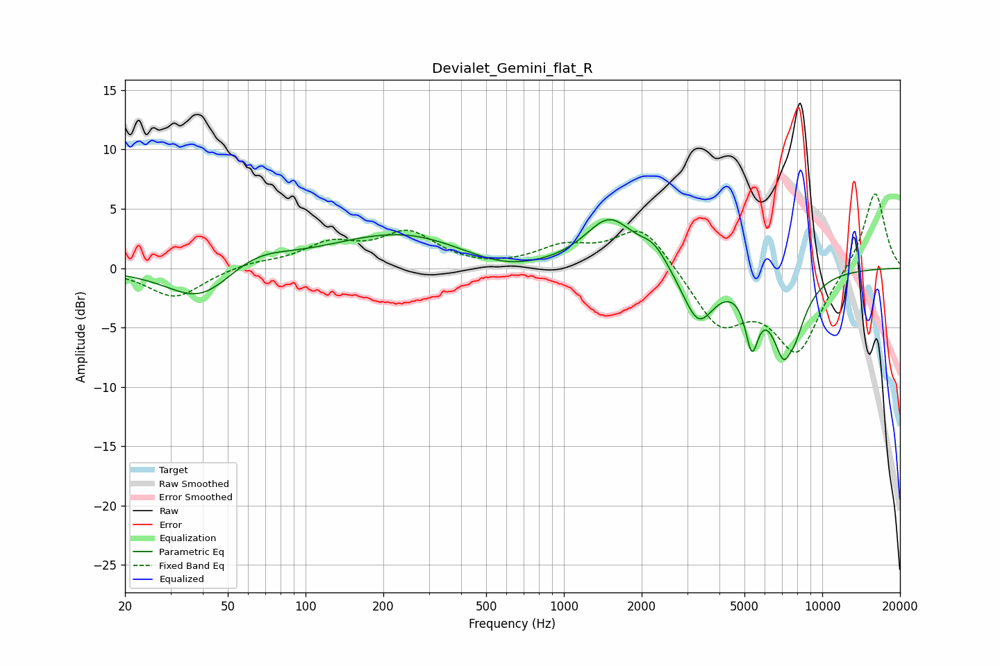

# Devialet_Gemini_flat_R
See [usage instructions](https://github.com/jaakkopasanen/AutoEq#usage) for more options and info.

### Parametric EQs
Apply preamp of -4.2 dB when using parametric equalizer.

|   # | Type    |   Fc (Hz) |    Q |   Gain (dB) |
|-----|---------|-----------|------|-------------|
|   1 | Peaking |        39 | 1.1  |        -3   |
|   2 | Peaking |        64 | 1.12 |         1.4 |
|   3 | Peaking |       239 | 0.52 |         3   |
|   4 | Peaking |       572 | 0.86 |        -1.2 |
|   5 | Peaking |      1501 | 1.48 |         4.1 |
|   6 | Peaking |      2231 | 2.63 |         1.5 |
|   7 | Peaking |      3313 | 2.26 |        -4.5 |
|   8 | Peaking |      5340 | 5.41 |        -4.7 |
|   9 | Peaking |      7327 | 2.69 |        -9   |
|  10 | Peaking |      7433 | 6    |         2   |

### Fixed Band EQs
When using fixed band (also called graphic) equalizer, apply preamp of **-6.4 dB** (if available) and set gains manually with these parameters.

|   # | Type    |   Fc (Hz) |    Q |   Gain (dB) |
|-----|---------|-----------|------|-------------|
|   1 | Peaking |        31 | 1.41 |        -2.5 |
|   2 | Peaking |        62 | 1.41 |         0.4 |
|   3 | Peaking |       125 | 1.41 |         1.9 |
|   4 | Peaking |       250 | 1.41 |         2.8 |
|   5 | Peaking |       500 | 1.41 |        -0.1 |
|   6 | Peaking |      1000 | 1.41 |         1.6 |
|   7 | Peaking |      2000 | 1.41 |         3.7 |
|   8 | Peaking |      4000 | 1.41 |        -4.6 |
|   9 | Peaking |      8000 | 1.41 |        -6.9 |
|  10 | Peaking |     16000 | 1.41 |         6.7 |

### Graphs

