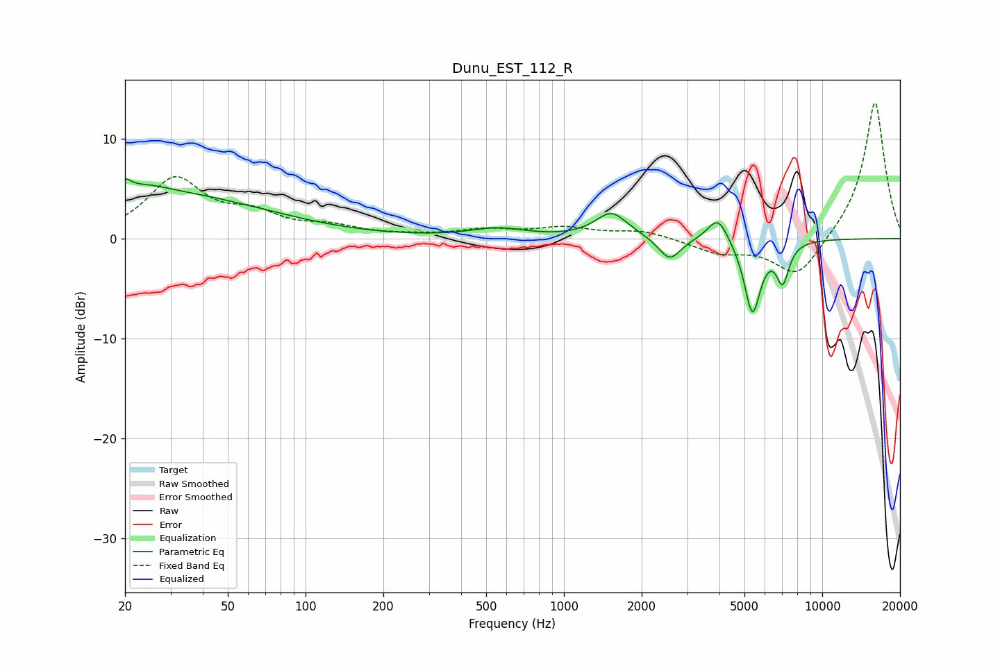

# Dunu_EST_112_R
See [usage instructions](https://github.com/jaakkopasanen/AutoEq#usage) for more options and info.

### Parametric EQs
Apply preamp of -6.1 dB when using parametric equalizer.

|   # | Type    |   Fc (Hz) |    Q |   Gain (dB) |
|-----|---------|-----------|------|-------------|
|   1 | Peaking |        20 | 0.26 |         4.9 |
|   2 | Peaking |        20 | 5.98 |         3.2 |
|   3 | Peaking |        20 | 5.93 |        -2.4 |
|   4 | Peaking |        25 | 2.02 |         0.4 |
|   5 | Peaking |       555 | 1.32 |         0.9 |
|   6 | Peaking |      1529 | 2.27 |         2.6 |
|   7 | Peaking |      2568 | 3.34 |        -2.3 |
|   8 | Peaking |      3948 | 3.52 |         2.6 |
|   9 | Peaking |      5369 | 4.33 |        -7.4 |
|  10 | Peaking |      7031 | 5.61 |        -3.8 |

### Fixed Band EQs
When using fixed band (also called graphic) equalizer, apply preamp of **-13.7 dB** (if available) and set gains manually with these parameters.

|   # | Type    |   Fc (Hz) |    Q |   Gain (dB) |
|-----|---------|-----------|------|-------------|
|   1 | Peaking |        31 | 1.41 |         5.8 |
|   2 | Peaking |        62 | 1.41 |         2   |
|   3 | Peaking |       125 | 1.41 |         1   |
|   4 | Peaking |       250 | 1.41 |         0.2 |
|   5 | Peaking |       500 | 1.41 |         0.8 |
|   6 | Peaking |      1000 | 1.41 |         1   |
|   7 | Peaking |      2000 | 1.41 |         0.8 |
|   8 | Peaking |      4000 | 1.41 |        -1.3 |
|   9 | Peaking |      8000 | 1.41 |        -4.1 |
|  10 | Peaking |     16000 | 1.41 |        13.9 |

### Graphs

