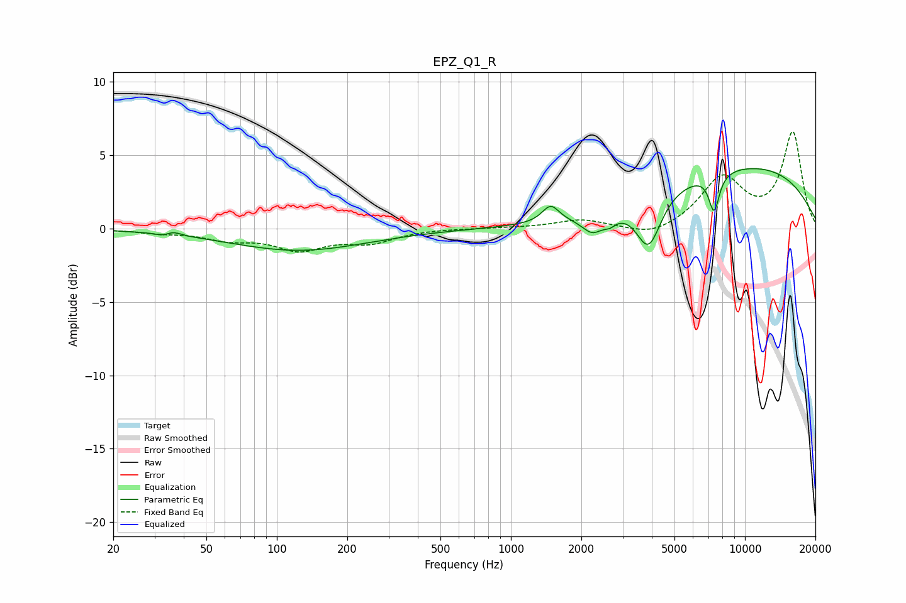

# EPZ_Q1_R
See [usage instructions](https://github.com/jaakkopasanen/AutoEq#usage) for more options and info.

### Parametric EQs
Apply preamp of -4.2 dB when using parametric equalizer.

|   # | Type    |   Fc (Hz) |    Q |   Gain (dB) |
|-----|---------|-----------|------|-------------|
|   1 | Peaking |        33 | 4.96 |        -0.2 |
|   2 | Peaking |        36 | 4.64 |         0.3 |
|   3 | Peaking |       124 | 0.48 |        -1.5 |
|   4 | Peaking |      1449 | 4.8  |        -0   |
|   5 | Peaking |      1478 | 3.94 |         1.2 |
|   6 | Peaking |      2233 | 3.03 |        -1.2 |
|   7 | Peaking |      2650 | 5.43 |        -0.4 |
|   8 | Peaking |      3876 | 2.67 |        -3.5 |
|   9 | Peaking |      7382 | 5.97 |        -2.6 |
|  10 | Peaking |     10000 | 0.29 |         4.2 |

### Fixed Band EQs
When using fixed band (also called graphic) equalizer, apply preamp of **-6.7 dB** (if available) and set gains manually with these parameters.

|   # | Type    |   Fc (Hz) |    Q |   Gain (dB) |
|-----|---------|-----------|------|-------------|
|   1 | Peaking |        31 | 1.41 |        -0.2 |
|   2 | Peaking |        62 | 1.41 |        -0.6 |
|   3 | Peaking |       125 | 1.41 |        -1.3 |
|   4 | Peaking |       250 | 1.41 |        -0.9 |
|   5 | Peaking |       500 | 1.41 |         0   |
|   6 | Peaking |      1000 | 1.41 |         0   |
|   7 | Peaking |      2000 | 1.41 |         0.6 |
|   8 | Peaking |      4000 | 1.41 |        -0.7 |
|   9 | Peaking |      8000 | 1.41 |         3.4 |
|  10 | Peaking |     16000 | 1.41 |         6.5 |

### Graphs

