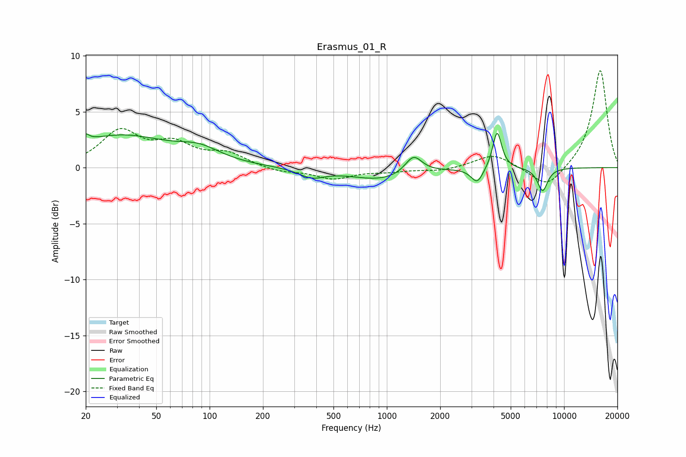

# Erasmus_01_R
See [usage instructions](https://github.com/jaakkopasanen/AutoEq#usage) for more options and info.

### Parametric EQs
Apply preamp of -3.2 dB when using parametric equalizer.

|   # | Type    |   Fc (Hz) |    Q |   Gain (dB) |
|-----|---------|-----------|------|-------------|
|   1 | Peaking |        20 | 5.98 |         3   |
|   2 | Peaking |        20 | 6    |        -2.3 |
|   3 | Peaking |        31 | 0.51 |         2.8 |
|   4 | Peaking |        88 | 1.2  |         1.1 |
|   5 | Peaking |       377 | 1.94 |        -0.8 |
|   6 | Peaking |       925 | 0.82 |        -1.1 |
|   7 | Peaking |      1415 | 2.99 |         1.6 |
|   8 | Peaking |      3236 | 4.16 |        -1.4 |
|   9 | Peaking |      4191 | 5.7  |         3.4 |
|  10 | Peaking |      7567 | 4.72 |        -2.1 |

### Fixed Band EQs
When using fixed band (also called graphic) equalizer, apply preamp of **-8.8 dB** (if available) and set gains manually with these parameters.

|   # | Type    |   Fc (Hz) |    Q |   Gain (dB) |
|-----|---------|-----------|------|-------------|
|   1 | Peaking |        31 | 1.41 |         3.1 |
|   2 | Peaking |        62 | 1.41 |         1.8 |
|   3 | Peaking |       125 | 1.41 |         1.1 |
|   4 | Peaking |       250 | 1.41 |        -0.4 |
|   5 | Peaking |       500 | 1.41 |        -1   |
|   6 | Peaking |      1000 | 1.41 |        -0.3 |
|   7 | Peaking |      2000 | 1.41 |        -0.3 |
|   8 | Peaking |      4000 | 1.41 |         1.2 |
|   9 | Peaking |      8000 | 1.41 |        -1.9 |
|  10 | Peaking |     16000 | 1.41 |         8.8 |

### Graphs

