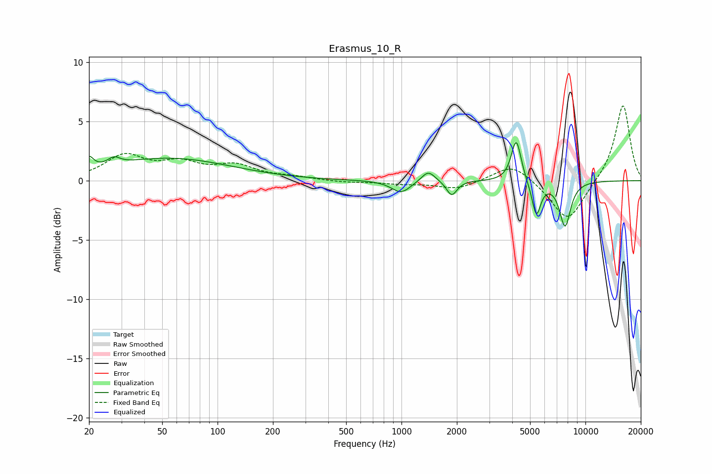

# Erasmus_10_R
See [usage instructions](https://github.com/jaakkopasanen/AutoEq#usage) for more options and info.

### Parametric EQs
Apply preamp of -3.3 dB when using parametric equalizer.

|   # | Type    |   Fc (Hz) |    Q |   Gain (dB) |
|-----|---------|-----------|------|-------------|
|   1 | Peaking |        20 | 6    |         1   |
|   2 | Peaking |        27 | 4.42 |         0.6 |
|   3 | Peaking |        54 | 0.42 |         1.9 |
|   4 | Peaking |       996 | 2.71 |        -1   |
|   5 | Peaking |      1397 | 3.83 |         1   |
|   6 | Peaking |      1874 | 5.06 |        -1.3 |
|   7 | Peaking |      4207 | 5.25 |         3.6 |
|   8 | Peaking |      5396 | 4.2  |        -0.4 |
|   9 | Peaking |      5410 | 6    |        -2.5 |
|  10 | Peaking |      7746 | 4.38 |        -3.8 |

### Fixed Band EQs
When using fixed band (also called graphic) equalizer, apply preamp of **-6.4 dB** (if available) and set gains manually with these parameters.

|   # | Type    |   Fc (Hz) |    Q |   Gain (dB) |
|-----|---------|-----------|------|-------------|
|   1 | Peaking |        31 | 1.41 |         2   |
|   2 | Peaking |        62 | 1.41 |         1.3 |
|   3 | Peaking |       125 | 1.41 |         1.1 |
|   4 | Peaking |       250 | 1.41 |         0.2 |
|   5 | Peaking |       500 | 1.41 |        -0.1 |
|   6 | Peaking |      1000 | 1.41 |        -0.2 |
|   7 | Peaking |      2000 | 1.41 |        -0.7 |
|   8 | Peaking |      4000 | 1.41 |         1.5 |
|   9 | Peaking |      8000 | 1.41 |        -3.5 |
|  10 | Peaking |     16000 | 1.41 |         6.5 |

### Graphs

