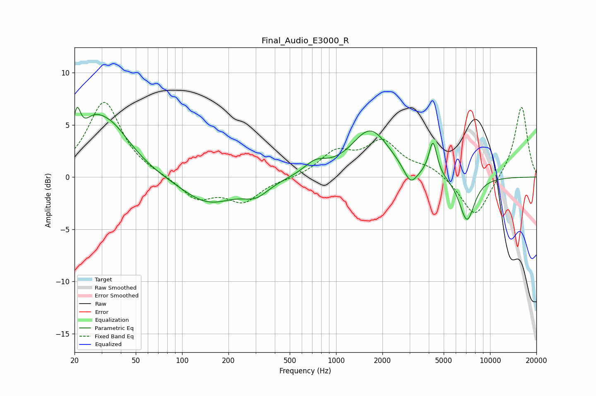

# Final_Audio_E3000_R
See [usage instructions](https://github.com/jaakkopasanen/AutoEq#usage) for more options and info.

### Parametric EQs
Apply preamp of -6.8 dB when using parametric equalizer.

|   # | Type    |   Fc (Hz) |    Q |   Gain (dB) |
|-----|---------|-----------|------|-------------|
|   1 | Peaking |        21 | 5.72 |         3.4 |
|   2 | Peaking |        26 | 2.09 |         1.8 |
|   3 | Peaking |        33 | 0.97 |         4.8 |
|   4 | Peaking |       147 | 0.8  |        -2.5 |
|   5 | Peaking |       302 | 1.68 |        -1.3 |
|   6 | Peaking |       732 | 1.96 |         1.1 |
|   7 | Peaking |      1673 | 1.16 |         4.5 |
|   8 | Peaking |      3045 | 3.29 |        -1.8 |
|   9 | Peaking |      4259 | 5.34 |         3.3 |
|  10 | Peaking |      7080 | 2.7  |        -4.3 |

### Fixed Band EQs
When using fixed band (also called graphic) equalizer, apply preamp of **-7.2 dB** (if available) and set gains manually with these parameters.

|   # | Type    |   Fc (Hz) |    Q |   Gain (dB) |
|-----|---------|-----------|------|-------------|
|   1 | Peaking |        31 | 1.41 |         7.2 |
|   2 | Peaking |        62 | 1.41 |         0.1 |
|   3 | Peaking |       125 | 1.41 |        -2.1 |
|   4 | Peaking |       250 | 1.41 |        -2.2 |
|   5 | Peaking |       500 | 1.41 |        -0.2 |
|   6 | Peaking |      1000 | 1.41 |         2.2 |
|   7 | Peaking |      2000 | 1.41 |         3.2 |
|   8 | Peaking |      4000 | 1.41 |         0.9 |
|   9 | Peaking |      8000 | 1.41 |        -4   |
|  10 | Peaking |     16000 | 1.41 |         6.9 |

### Graphs

