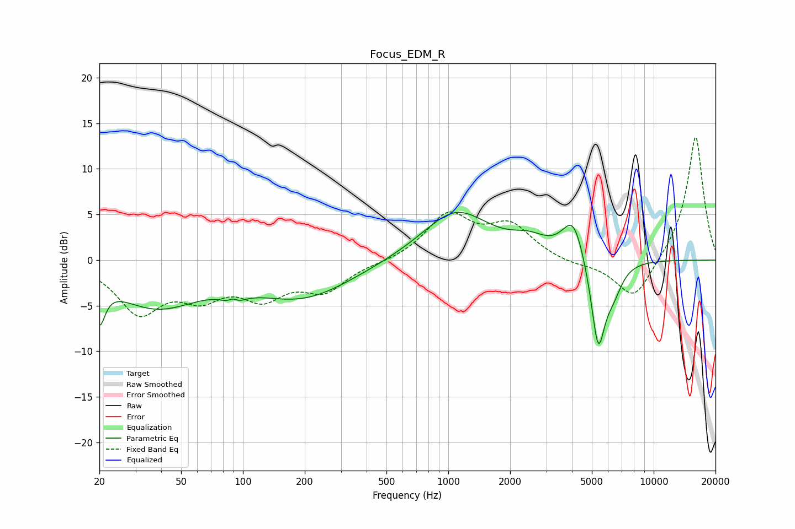

# Focus_EDM_R
See [usage instructions](https://github.com/jaakkopasanen/AutoEq#usage) for more options and info.

### Parametric EQs
Apply preamp of -5.3 dB when using parametric equalizer.

|   # | Type    |   Fc (Hz) |    Q |   Gain (dB) |
|-----|---------|-----------|------|-------------|
|   1 | Peaking |        20 | 5.25 |        -4.3 |
|   2 | Peaking |        38 | 0.66 |        -4.9 |
|   3 | Peaking |        90 | 4.95 |         3.6 |
|   4 | Peaking |        90 | 4.15 |        -4.1 |
|   5 | Peaking |       196 | 0.58 |        -4   |
|   6 | Peaking |      1090 | 0.85 |         5.4 |
|   7 | Peaking |      2480 | 1.68 |         1.4 |
|   8 | Peaking |      4062 | 2.61 |         4.6 |
|   9 | Peaking |      5368 | 3.88 |        -9.9 |
|  10 | Peaking |      6368 | 3.14 |        -2.5 |

### Fixed Band EQs
When using fixed band (also called graphic) equalizer, apply preamp of **-13.6 dB** (if available) and set gains manually with these parameters.

|   # | Type    |   Fc (Hz) |    Q |   Gain (dB) |
|-----|---------|-----------|------|-------------|
|   1 | Peaking |        31 | 1.41 |        -5.4 |
|   2 | Peaking |        62 | 1.41 |        -3.3 |
|   3 | Peaking |       125 | 1.41 |        -3.5 |
|   4 | Peaking |       250 | 1.41 |        -3.1 |
|   5 | Peaking |       500 | 1.41 |        -0.2 |
|   6 | Peaking |      1000 | 1.41 |         4.8 |
|   7 | Peaking |      2000 | 1.41 |         3.6 |
|   8 | Peaking |      4000 | 1.41 |        -0.5 |
|   9 | Peaking |      8000 | 1.41 |        -4.6 |
|  10 | Peaking |     16000 | 1.41 |        13.8 |

### Graphs

