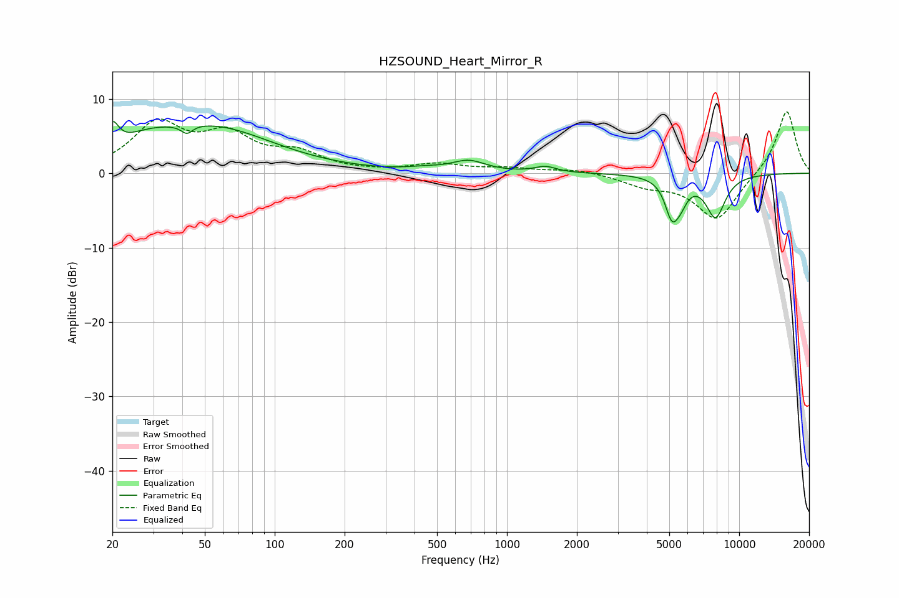

# HZSOUND_Heart_Mirror_R
See [usage instructions](https://github.com/jaakkopasanen/AutoEq#usage) for more options and info.

### Parametric EQs
Apply preamp of -7.0 dB when using parametric equalizer.

|   # | Type    |   Fc (Hz) |    Q |   Gain (dB) |
|-----|---------|-----------|------|-------------|
|   1 | Peaking |        20 | 5.42 |         3.3 |
|   2 | Peaking |        28 | 1.06 |         2.1 |
|   3 | Peaking |        42 | 5.91 |        -1.2 |
|   4 | Peaking |        55 | 0.54 |         5.8 |
|   5 | Peaking |       445 | 1.9  |         0.3 |
|   6 | Peaking |       685 | 1.96 |         1.5 |
|   7 | Peaking |      1463 | 3.06 |         0.8 |
|   8 | Peaking |      5119 | 4.78 |        -4.5 |
|   9 | Peaking |      5573 | 4.34 |        -2.4 |
|  10 | Peaking |      7908 | 3.11 |        -5.6 |

### Fixed Band EQs
When using fixed band (also called graphic) equalizer, apply preamp of **-8.4 dB** (if available) and set gains manually with these parameters.

|   # | Type    |   Fc (Hz) |    Q |   Gain (dB) |
|-----|---------|-----------|------|-------------|
|   1 | Peaking |        31 | 1.41 |         6.3 |
|   2 | Peaking |        62 | 1.41 |         4.5 |
|   3 | Peaking |       125 | 1.41 |         2.3 |
|   4 | Peaking |       250 | 1.41 |         0.1 |
|   5 | Peaking |       500 | 1.41 |         1.1 |
|   6 | Peaking |      1000 | 1.41 |         0.6 |
|   7 | Peaking |      2000 | 1.41 |         0.6 |
|   8 | Peaking |      4000 | 1.41 |        -1.4 |
|   9 | Peaking |      8000 | 1.41 |        -6.3 |
|  10 | Peaking |     16000 | 1.41 |         8.6 |

### Graphs

