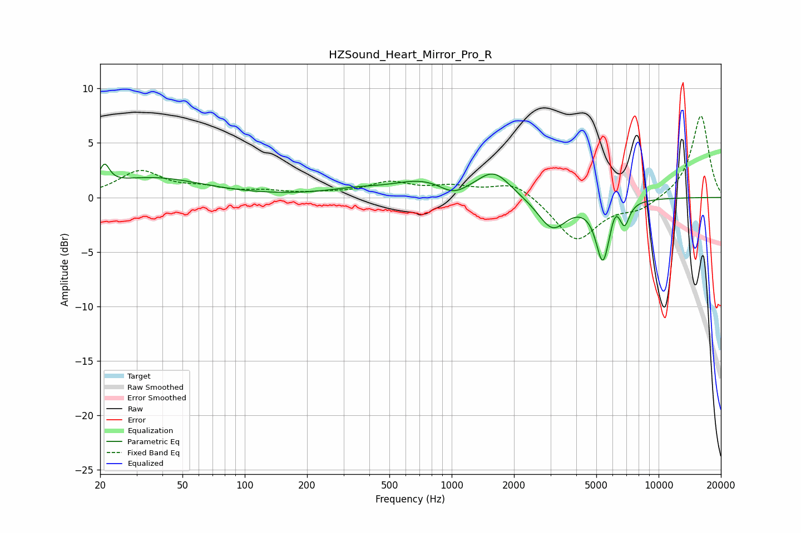

# HZSound_Heart_Mirror_Pro_R
See [usage instructions](https://github.com/jaakkopasanen/AutoEq#usage) for more options and info.

### Parametric EQs
Apply preamp of -3.1 dB when using parametric equalizer.

|   # | Type    |   Fc (Hz) |    Q |   Gain (dB) |
|-----|---------|-----------|------|-------------|
|   1 | Peaking |        21 | 5.97 |         1.8 |
|   2 | Peaking |        36 | 0.59 |         1.8 |
|   3 | Peaking |       340 | 0.98 |         0.5 |
|   4 | Peaking |       728 | 0.97 |         1.4 |
|   5 | Peaking |      1016 | 2.2  |        -0.9 |
|   6 | Peaking |      1596 | 1.76 |         2.3 |
|   7 | Peaking |      3066 | 2    |        -2.9 |
|   8 | Peaking |      5379 | 4.14 |        -5.6 |
|   9 | Peaking |      6158 | 6    |         1.1 |
|  10 | Peaking |      6850 | 6    |        -1.9 |

### Fixed Band EQs
When using fixed band (also called graphic) equalizer, apply preamp of **-7.6 dB** (if available) and set gains manually with these parameters.

|   # | Type    |   Fc (Hz) |    Q |   Gain (dB) |
|-----|---------|-----------|------|-------------|
|   1 | Peaking |        31 | 1.41 |         2.3 |
|   2 | Peaking |        62 | 1.41 |         0.7 |
|   3 | Peaking |       125 | 1.41 |         0.4 |
|   4 | Peaking |       250 | 1.41 |         0.2 |
|   5 | Peaking |       500 | 1.41 |         1.2 |
|   6 | Peaking |      1000 | 1.41 |         0.8 |
|   7 | Peaking |      2000 | 1.41 |         1.5 |
|   8 | Peaking |      4000 | 1.41 |        -4   |
|   9 | Peaking |      8000 | 1.41 |        -1   |
|  10 | Peaking |     16000 | 1.41 |         7.6 |

### Graphs

