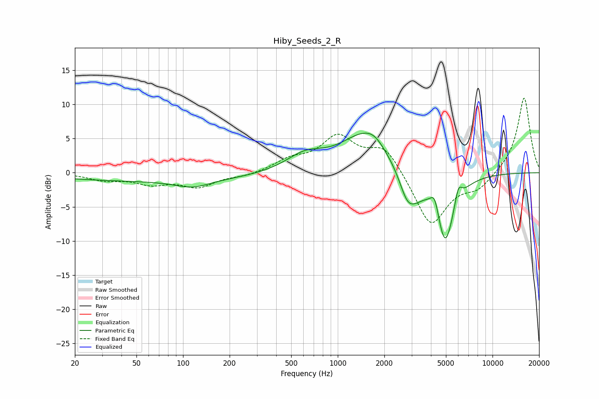

# Hiby_Seeds_2_R
See [usage instructions](https://github.com/jaakkopasanen/AutoEq#usage) for more options and info.

### Parametric EQs
Apply preamp of -5.9 dB when using parametric equalizer.

|   # | Type    |   Fc (Hz) |    Q |   Gain (dB) |
|-----|---------|-----------|------|-------------|
|   1 | Peaking |        64 | 0.2  |        -1.2 |
|   2 | Peaking |       115 | 1.29 |        -1.1 |
|   3 | Peaking |       613 | 1.15 |         2.3 |
|   4 | Peaking |      1493 | 0.9  |         5.4 |
|   5 | Peaking |      1723 | 2.35 |         1   |
|   6 | Peaking |      2819 | 2.61 |        -4.1 |
|   7 | Peaking |      3254 | 2.35 |        -1.7 |
|   8 | Peaking |      4233 | 5.38 |         2.7 |
|   9 | Peaking |      4942 | 2.31 |       -10.5 |
|  10 | Peaking |      6012 | 6    |         2.5 |

### Fixed Band EQs
When using fixed band (also called graphic) equalizer, apply preamp of **-11.0 dB** (if available) and set gains manually with these parameters.

|   # | Type    |   Fc (Hz) |    Q |   Gain (dB) |
|-----|---------|-----------|------|-------------|
|   1 | Peaking |        31 | 1.41 |        -1   |
|   2 | Peaking |        62 | 1.41 |        -1.4 |
|   3 | Peaking |       125 | 1.41 |        -2   |
|   4 | Peaking |       250 | 1.41 |        -0.5 |
|   5 | Peaking |       500 | 1.41 |         1.6 |
|   6 | Peaking |      1000 | 1.41 |         5   |
|   7 | Peaking |      2000 | 1.41 |         3.9 |
|   8 | Peaking |      4000 | 1.41 |        -8   |
|   9 | Peaking |      8000 | 1.41 |        -2.1 |
|  10 | Peaking |     16000 | 1.41 |        11.2 |

### Graphs

