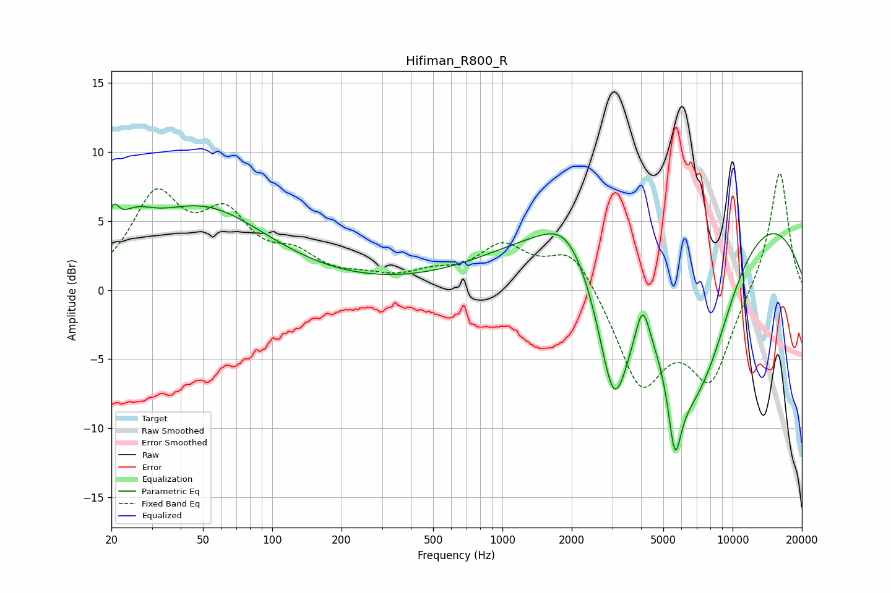

# Hifiman_R800_R
See [usage instructions](https://github.com/jaakkopasanen/AutoEq#usage) for more options and info.

### Parametric EQs
Apply preamp of -6.3 dB when using parametric equalizer.

|   # | Type    |   Fc (Hz) |    Q |   Gain (dB) |
|-----|---------|-----------|------|-------------|
|   1 | Peaking |        20 | 5.72 |         2   |
|   2 | Peaking |        25 | 1.8  |         1.9 |
|   3 | Peaking |        49 | 0.5  |         5.8 |
|   4 | Peaking |      1892 | 1.52 |         1.7 |
|   5 | Peaking |      3053 | 1.85 |       -11   |
|   6 | Peaking |      4064 | 4.72 |         2.9 |
|   7 | Peaking |      5612 | 5.05 |        -5.3 |
|   8 | Peaking |      6244 | 0.83 |       -12.5 |
|   9 | Peaking |      6293 | 0.18 |         9   |
|  10 | Peaking |      8031 | 1.11 |        -4   |

### Fixed Band EQs
When using fixed band (also called graphic) equalizer, apply preamp of **-8.5 dB** (if available) and set gains manually with these parameters.

|   # | Type    |   Fc (Hz) |    Q |   Gain (dB) |
|-----|---------|-----------|------|-------------|
|   1 | Peaking |        31 | 1.41 |         6.4 |
|   2 | Peaking |        62 | 1.41 |         4.6 |
|   3 | Peaking |       125 | 1.41 |         2   |
|   4 | Peaking |       250 | 1.41 |         0.6 |
|   5 | Peaking |       500 | 1.41 |         0.9 |
|   6 | Peaking |      1000 | 1.41 |         2.9 |
|   7 | Peaking |      2000 | 1.41 |         3.1 |
|   8 | Peaking |      4000 | 1.41 |        -6.8 |
|   9 | Peaking |      8000 | 1.41 |        -6.2 |
|  10 | Peaking |     16000 | 1.41 |         8.9 |

### Graphs

