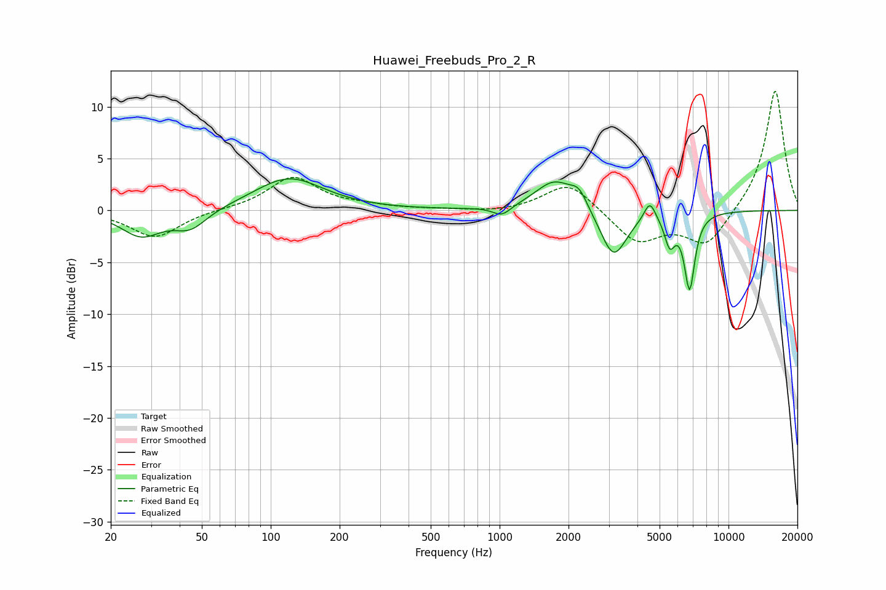

# Huawei_Freebuds_Pro_2_R
See [usage instructions](https://github.com/jaakkopasanen/AutoEq#usage) for more options and info.

### Parametric EQs
Apply preamp of -3.1 dB when using parametric equalizer.

|   # | Type    |   Fc (Hz) |    Q |   Gain (dB) |
|-----|---------|-----------|------|-------------|
|   1 | Peaking |        27 | 1.61 |        -2.4 |
|   2 | Peaking |        45 | 1.96 |        -1.8 |
|   3 | Peaking |       120 | 0.94 |         3.2 |
|   4 | Peaking |      1023 | 3.57 |        -1   |
|   5 | Peaking |      1740 | 1.66 |         2.9 |
|   6 | Peaking |      2223 | 3.83 |         1.5 |
|   7 | Peaking |      3146 | 2.44 |        -4.7 |
|   8 | Peaking |      4531 | 5.61 |         1.9 |
|   9 | Peaking |      5540 | 6    |        -2.7 |
|  10 | Peaking |      6762 | 5.93 |        -7.3 |

### Fixed Band EQs
When using fixed band (also called graphic) equalizer, apply preamp of **-11.6 dB** (if available) and set gains manually with these parameters.

|   # | Type    |   Fc (Hz) |    Q |   Gain (dB) |
|-----|---------|-----------|------|-------------|
|   1 | Peaking |        31 | 1.41 |        -2.6 |
|   2 | Peaking |        62 | 1.41 |         0.1 |
|   3 | Peaking |       125 | 1.41 |         3.2 |
|   4 | Peaking |       250 | 1.41 |         0.3 |
|   5 | Peaking |       500 | 1.41 |         0.1 |
|   6 | Peaking |      1000 | 1.41 |        -0.2 |
|   7 | Peaking |      2000 | 1.41 |         2.8 |
|   8 | Peaking |      4000 | 1.41 |        -3.1 |
|   9 | Peaking |      8000 | 1.41 |        -3.4 |
|  10 | Peaking |     16000 | 1.41 |        11.8 |

### Graphs

