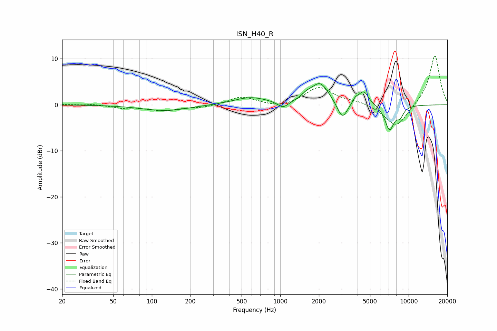

# ISN_H40_R
See [usage instructions](https://github.com/jaakkopasanen/AutoEq#usage) for more options and info.

### Parametric EQs
Apply preamp of -4.7 dB when using parametric equalizer.

|   # | Type    |   Fc (Hz) |    Q |   Gain (dB) |
|-----|---------|-----------|------|-------------|
|   1 | Peaking |       127 | 0.8  |        -1.3 |
|   2 | Peaking |       584 | 1.07 |         1.6 |
|   3 | Peaking |      1050 | 3.4  |        -1.5 |
|   4 | Peaking |      1601 | 3.39 |         1   |
|   5 | Peaking |      2045 | 2.06 |         4.6 |
|   6 | Peaking |      3045 | 3.53 |        -3.9 |
|   7 | Peaking |      3858 | 6    |         1.1 |
|   8 | Peaking |      4465 | 3.65 |         3   |
|   9 | Peaking |      7093 | 3.68 |        -5.4 |
|  10 | Peaking |      8582 | 4.86 |        -1.9 |

### Fixed Band EQs
When using fixed band (also called graphic) equalizer, apply preamp of **-10.7 dB** (if available) and set gains manually with these parameters.

|   # | Type    |   Fc (Hz) |    Q |   Gain (dB) |
|-----|---------|-----------|------|-------------|
|   1 | Peaking |        31 | 1.41 |         0.3 |
|   2 | Peaking |        62 | 1.41 |        -0.7 |
|   3 | Peaking |       125 | 1.41 |        -1.2 |
|   4 | Peaking |       250 | 1.41 |        -0.6 |
|   5 | Peaking |       500 | 1.41 |         1.8 |
|   6 | Peaking |      1000 | 1.41 |        -0.8 |
|   7 | Peaking |      2000 | 1.41 |         3.8 |
|   8 | Peaking |      4000 | 1.41 |         0.7 |
|   9 | Peaking |      8000 | 1.41 |        -5.1 |
|  10 | Peaking |     16000 | 1.41 |        10.9 |

### Graphs

