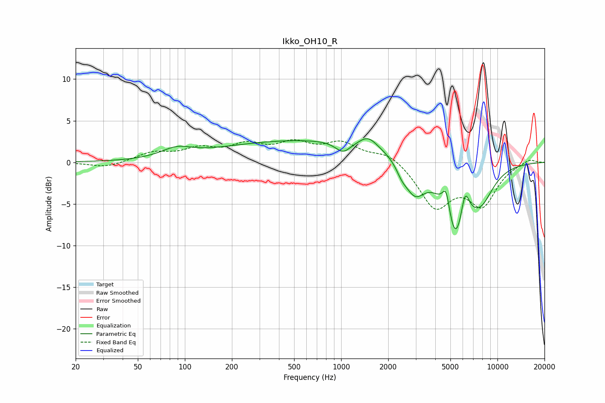

# Ikko_OH10_R
See [usage instructions](https://github.com/jaakkopasanen/AutoEq#usage) for more options and info.

### Parametric EQs
Apply preamp of -2.9 dB when using parametric equalizer.

|   # | Type    |   Fc (Hz) |    Q |   Gain (dB) |
|-----|---------|-----------|------|-------------|
|   1 | Peaking |        89 | 1.45 |         1.1 |
|   2 | Peaking |       779 | 0.19 |         2.8 |
|   3 | Peaking |      1029 | 2.87 |        -1.4 |
|   4 | Peaking |      1488 | 2.51 |         1.3 |
|   5 | Peaking |      2436 | 4.2  |        -0.9 |
|   6 | Peaking |      2947 | 1.98 |        -4.3 |
|   7 | Peaking |      4703 | 5.47 |         3.5 |
|   8 | Peaking |      5381 | 1.81 |        -9.5 |
|   9 | Peaking |      6193 | 4.86 |         3.9 |
|  10 | Peaking |      7848 | 1.62 |        -3.4 |

### Fixed Band EQs
When using fixed band (also called graphic) equalizer, apply preamp of **-2.8 dB** (if available) and set gains manually with these parameters.

|   # | Type    |   Fc (Hz) |    Q |   Gain (dB) |
|-----|---------|-----------|------|-------------|
|   1 | Peaking |        31 | 1.41 |        -0.7 |
|   2 | Peaking |        62 | 1.41 |         1.1 |
|   3 | Peaking |       125 | 1.41 |         1.4 |
|   4 | Peaking |       250 | 1.41 |         1.8 |
|   5 | Peaking |       500 | 1.41 |         2   |
|   6 | Peaking |      1000 | 1.41 |         2.1 |
|   7 | Peaking |      2000 | 1.41 |         1.3 |
|   8 | Peaking |      4000 | 1.41 |        -5.2 |
|   9 | Peaking |      8000 | 1.41 |        -4.8 |
|  10 | Peaking |     16000 | 1.41 |         0.5 |

### Graphs

