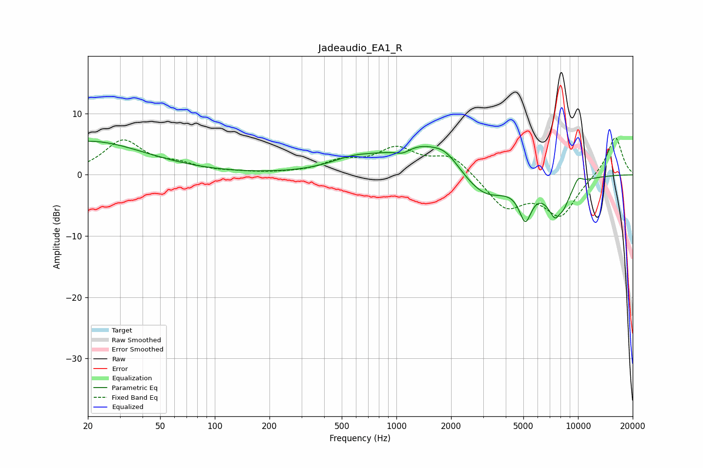

# Jadeaudio_EA1_R
See [usage instructions](https://github.com/jaakkopasanen/AutoEq#usage) for more options and info.

### Parametric EQs
Apply preamp of -5.6 dB when using parametric equalizer.

|   # | Type    |   Fc (Hz) |    Q |   Gain (dB) |
|-----|---------|-----------|------|-------------|
|   1 | Peaking |        20 | 0.45 |         5.5 |
|   2 | Peaking |       581 | 1.07 |         1.8 |
|   3 | Peaking |      1083 | 3.25 |        -1   |
|   4 | Peaking |      1355 | 0.79 |         4.9 |
|   5 | Peaking |      1877 | 2    |         1.8 |
|   6 | Peaking |      3050 | 1.08 |        -4.4 |
|   7 | Peaking |      5127 | 3.95 |        -5.5 |
|   8 | Peaking |      7771 | 2.71 |        -8.3 |
|   9 | Peaking |      7877 | 6    |         2.2 |
|  10 | Peaking |     10000 | 4.78 |         1.4 |

### Fixed Band EQs
When using fixed band (also called graphic) equalizer, apply preamp of **-6.1 dB** (if available) and set gains manually with these parameters.

|   # | Type    |   Fc (Hz) |    Q |   Gain (dB) |
|-----|---------|-----------|------|-------------|
|   1 | Peaking |        31 | 1.41 |         5.4 |
|   2 | Peaking |        62 | 1.41 |         1.3 |
|   3 | Peaking |       125 | 1.41 |         0.3 |
|   4 | Peaking |       250 | 1.41 |         0.1 |
|   5 | Peaking |       500 | 1.41 |         1.9 |
|   6 | Peaking |      1000 | 1.41 |         3.9 |
|   7 | Peaking |      2000 | 1.41 |         3.1 |
|   8 | Peaking |      4000 | 1.41 |        -5.3 |
|   9 | Peaking |      8000 | 1.41 |        -6.4 |
|  10 | Peaking |     16000 | 1.41 |         6.4 |

### Graphs

