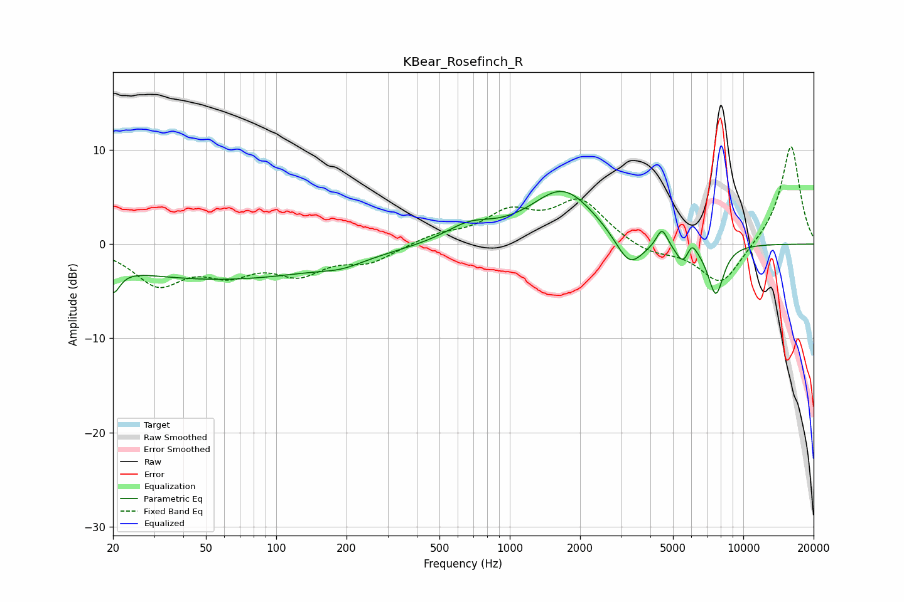

# KBear_Rosefinch_R
See [usage instructions](https://github.com/jaakkopasanen/AutoEq#usage) for more options and info.

### Parametric EQs
Apply preamp of -5.7 dB when using parametric equalizer.

|   # | Type    |   Fc (Hz) |    Q |   Gain (dB) |
|-----|---------|-----------|------|-------------|
|   1 | Peaking |        20 | 4.83 |        -2.7 |
|   2 | Peaking |        57 | 0.28 |        -3.7 |
|   3 | Peaking |       191 | 1.55 |        -0.7 |
|   4 | Peaking |       669 | 1.36 |         1.7 |
|   5 | Peaking |      1691 | 1.01 |         5.8 |
|   6 | Peaking |      3259 | 2.3  |        -3.5 |
|   7 | Peaking |      4487 | 5.94 |         2   |
|   8 | Peaking |      5538 | 4.4  |        -2.1 |
|   9 | Peaking |      6004 | 6    |         1.6 |
|  10 | Peaking |      7627 | 3.89 |        -5.3 |

### Fixed Band EQs
When using fixed band (also called graphic) equalizer, apply preamp of **-10.4 dB** (if available) and set gains manually with these parameters.

|   # | Type    |   Fc (Hz) |    Q |   Gain (dB) |
|-----|---------|-----------|------|-------------|
|   1 | Peaking |        31 | 1.41 |        -4   |
|   2 | Peaking |        62 | 1.41 |        -2.5 |
|   3 | Peaking |       125 | 1.41 |        -2.8 |
|   4 | Peaking |       250 | 1.41 |        -1.7 |
|   5 | Peaking |       500 | 1.41 |         0.9 |
|   6 | Peaking |      1000 | 1.41 |         3.1 |
|   7 | Peaking |      2000 | 1.41 |         4.5 |
|   8 | Peaking |      4000 | 1.41 |        -1.1 |
|   9 | Peaking |      8000 | 1.41 |        -4.5 |
|  10 | Peaking |     16000 | 1.41 |        10.6 |

### Graphs

