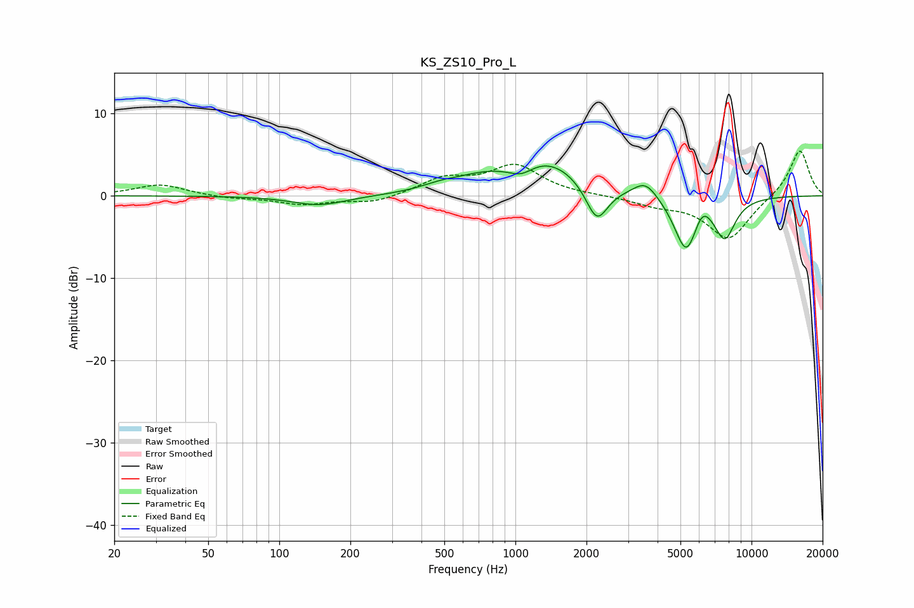

# KS_ZS10_Pro_L
See [usage instructions](https://github.com/jaakkopasanen/AutoEq#usage) for more options and info.

### Parametric EQs
Apply preamp of -3.7 dB when using parametric equalizer.

|   # | Type    |   Fc (Hz) |    Q |   Gain (dB) |
|-----|---------|-----------|------|-------------|
|   1 | Peaking |       148 | 1.25 |        -1.2 |
|   2 | Peaking |       483 | 1.6  |         0.7 |
|   3 | Peaking |       730 | 1.19 |         1.5 |
|   4 | Peaking |      1059 | 2.91 |        -1.1 |
|   5 | Peaking |      1376 | 0.97 |         4   |
|   6 | Peaking |      2213 | 3.01 |        -4.6 |
|   7 | Peaking |      3558 | 2.73 |         2   |
|   8 | Peaking |      5292 | 2.73 |        -6.9 |
|   9 | Peaking |      6179 | 3.81 |         2   |
|  10 | Peaking |      7707 | 3    |        -4.7 |

### Fixed Band EQs
When using fixed band (also called graphic) equalizer, apply preamp of **-5.5 dB** (if available) and set gains manually with these parameters.

|   # | Type    |   Fc (Hz) |    Q |   Gain (dB) |
|-----|---------|-----------|------|-------------|
|   1 | Peaking |        31 | 1.41 |         1.4 |
|   2 | Peaking |        62 | 1.41 |        -0.3 |
|   3 | Peaking |       125 | 1.41 |        -1   |
|   4 | Peaking |       250 | 1.41 |        -0.9 |
|   5 | Peaking |       500 | 1.41 |         2   |
|   6 | Peaking |      1000 | 1.41 |         3.6 |
|   7 | Peaking |      2000 | 1.41 |         0   |
|   8 | Peaking |      4000 | 1.41 |        -1   |
|   9 | Peaking |      8000 | 1.41 |        -5.3 |
|  10 | Peaking |     16000 | 1.41 |         5.7 |

### Graphs

