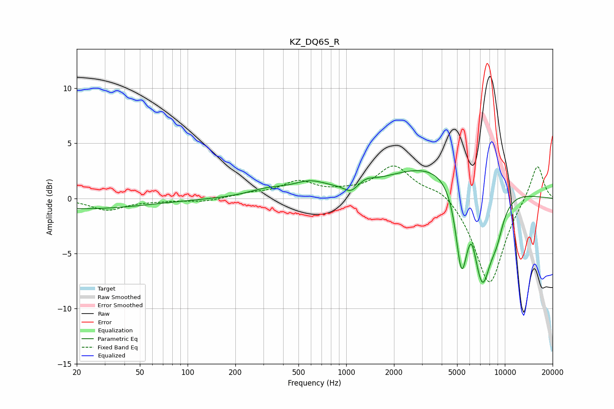

# KZ_DQ6S_R
See [usage instructions](https://github.com/jaakkopasanen/AutoEq#usage) for more options and info.

### Parametric EQs
Apply preamp of -2.6 dB when using parametric equalizer.

|   # | Type    |   Fc (Hz) |    Q |   Gain (dB) |
|-----|---------|-----------|------|-------------|
|   1 | Peaking |        22 | 0.36 |        -0.9 |
|   2 | Peaking |       317 | 1.15 |         0.6 |
|   3 | Peaking |       590 | 1.27 |         1.1 |
|   4 | Peaking |      1070 | 3.39 |        -0.7 |
|   5 | Peaking |      1335 | 3.09 |         0.4 |
|   6 | Peaking |      4159 | 0.41 |         3.5 |
|   7 | Peaking |      5324 | 3.82 |        -7   |
|   8 | Peaking |      6156 | 5.92 |         1.1 |
|   9 | Peaking |      7213 | 2.18 |        -8.8 |
|  10 | Peaking |      8874 | 2.73 |        -2.4 |

### Fixed Band EQs
When using fixed band (also called graphic) equalizer, apply preamp of **-3.0 dB** (if available) and set gains manually with these parameters.

|   # | Type    |   Fc (Hz) |    Q |   Gain (dB) |
|-----|---------|-----------|------|-------------|
|   1 | Peaking |        31 | 1.41 |        -1   |
|   2 | Peaking |        62 | 1.41 |        -0.2 |
|   3 | Peaking |       125 | 1.41 |        -0.3 |
|   4 | Peaking |       250 | 1.41 |         0.4 |
|   5 | Peaking |       500 | 1.41 |         1.4 |
|   6 | Peaking |      1000 | 1.41 |         0.4 |
|   7 | Peaking |      2000 | 1.41 |         2.9 |
|   8 | Peaking |      4000 | 1.41 |         1   |
|   9 | Peaking |      8000 | 1.41 |        -8   |
|  10 | Peaking |     16000 | 1.41 |         3.3 |

### Graphs

