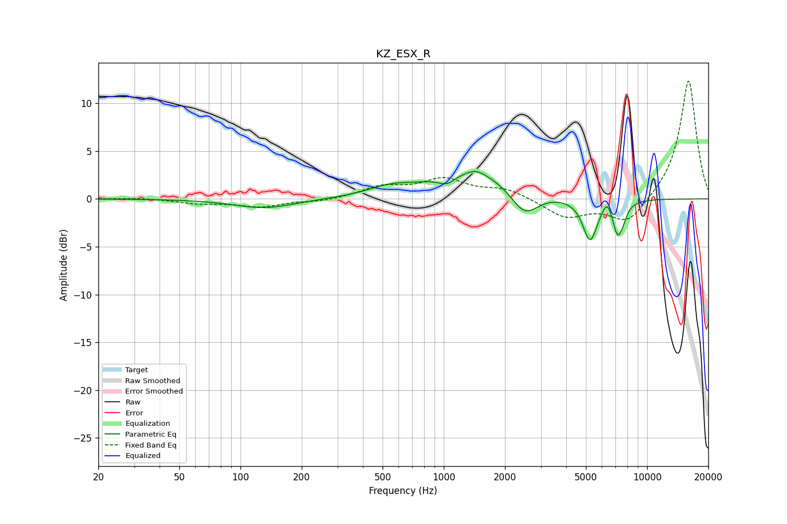

# KZ_ESX_R
See [usage instructions](https://github.com/jaakkopasanen/AutoEq#usage) for more options and info.

### Parametric EQs
Apply preamp of -3.0 dB when using parametric equalizer.

|   # | Type    |   Fc (Hz) |    Q |   Gain (dB) |
|-----|---------|-----------|------|-------------|
|   1 | Peaking |       131 | 0.96 |        -1   |
|   2 | Peaking |       545 | 1.29 |         0.9 |
|   3 | Peaking |      1038 | 3.3  |        -0.9 |
|   4 | Peaking |      1410 | 0.71 |         2.9 |
|   5 | Peaking |      1442 | 3.27 |         0.5 |
|   6 | Peaking |      2493 | 2.07 |        -2.8 |
|   7 | Peaking |      5245 | 3.85 |        -4.4 |
|   8 | Peaking |      6368 | 5.99 |         1.3 |
|   9 | Peaking |      7161 | 5.43 |        -3.3 |
|  10 | Peaking |      7629 | 6    |        -0.8 |

### Fixed Band EQs
When using fixed band (also called graphic) equalizer, apply preamp of **-12.4 dB** (if available) and set gains manually with these parameters.

|   # | Type    |   Fc (Hz) |    Q |   Gain (dB) |
|-----|---------|-----------|------|-------------|
|   1 | Peaking |        31 | 1.41 |         0.1 |
|   2 | Peaking |        62 | 1.41 |        -0.4 |
|   3 | Peaking |       125 | 1.41 |        -0.8 |
|   4 | Peaking |       250 | 1.41 |        -0.3 |
|   5 | Peaking |       500 | 1.41 |         1.2 |
|   6 | Peaking |      1000 | 1.41 |         1.9 |
|   7 | Peaking |      2000 | 1.41 |         1   |
|   8 | Peaking |      4000 | 1.41 |        -1.9 |
|   9 | Peaking |      8000 | 1.41 |        -2.7 |
|  10 | Peaking |     16000 | 1.41 |        12.6 |

### Graphs

