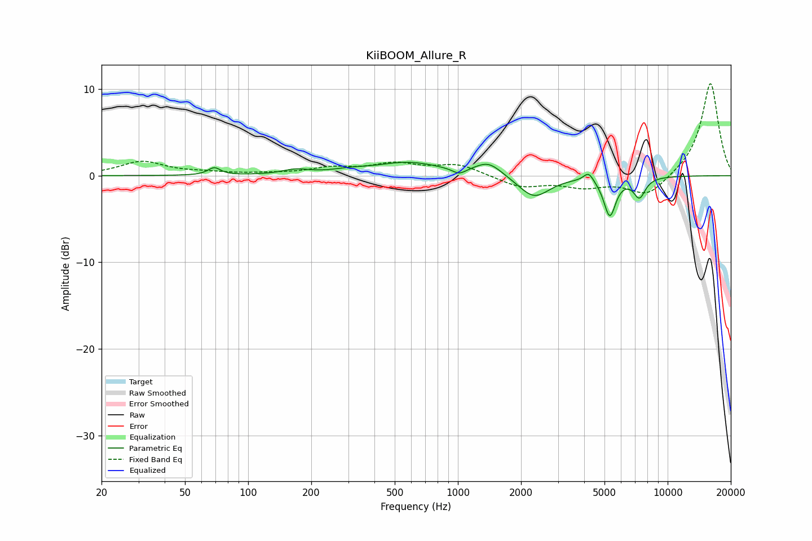

# KiiBOOM_Allure_R
See [usage instructions](https://github.com/jaakkopasanen/AutoEq#usage) for more options and info.

### Parametric EQs
Apply preamp of -1.6 dB when using parametric equalizer.

|   # | Type    |   Fc (Hz) |    Q |   Gain (dB) |
|-----|---------|-----------|------|-------------|
|   1 | Peaking |        69 | 4.97 |         0.9 |
|   2 | Peaking |       169 | 2.27 |         0.5 |
|   3 | Peaking |       304 | 1.66 |         0.3 |
|   4 | Peaking |       582 | 0.9  |         1.5 |
|   5 | Peaking |      1014 | 4.41 |        -0.7 |
|   6 | Peaking |      1399 | 2.23 |         1.5 |
|   7 | Peaking |      2307 | 1.9  |        -2.6 |
|   8 | Peaking |      4200 | 6    |         1.1 |
|   9 | Peaking |      5298 | 4.91 |        -4.5 |
|  10 | Peaking |      7335 | 4.79 |        -2.3 |

### Fixed Band EQs
When using fixed band (also called graphic) equalizer, apply preamp of **-10.7 dB** (if available) and set gains manually with these parameters.

|   # | Type    |   Fc (Hz) |    Q |   Gain (dB) |
|-----|---------|-----------|------|-------------|
|   1 | Peaking |        31 | 1.41 |         1.6 |
|   2 | Peaking |        62 | 1.41 |         0.3 |
|   3 | Peaking |       125 | 1.41 |         0.1 |
|   4 | Peaking |       250 | 1.41 |         0.8 |
|   5 | Peaking |       500 | 1.41 |         1.2 |
|   6 | Peaking |      1000 | 1.41 |         1.3 |
|   7 | Peaking |      2000 | 1.41 |        -1.3 |
|   8 | Peaking |      4000 | 1.41 |        -1.1 |
|   9 | Peaking |      8000 | 1.41 |        -2.4 |
|  10 | Peaking |     16000 | 1.41 |        10.8 |

### Graphs

