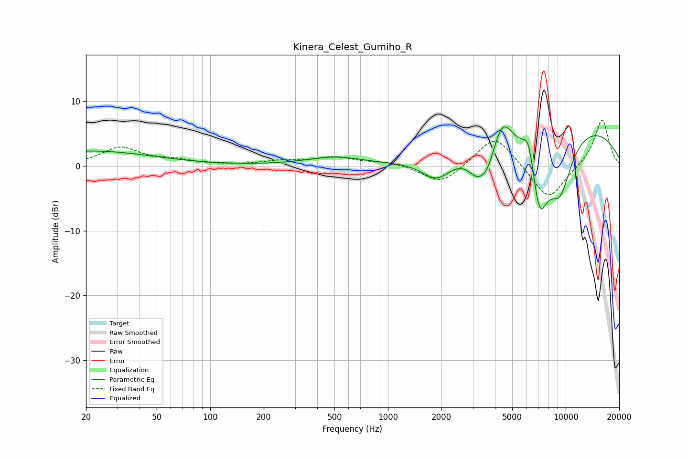

# Kinera_Celest_Gumiho_R
See [usage instructions](https://github.com/jaakkopasanen/AutoEq#usage) for more options and info.

### Parametric EQs
Apply preamp of -6.1 dB when using parametric equalizer.

|   # | Type    |   Fc (Hz) |    Q |   Gain (dB) |
|-----|---------|-----------|------|-------------|
|   1 | Peaking |        21 | 0.41 |         2.3 |
|   2 | Peaking |       498 | 0.9  |         1.3 |
|   3 | Peaking |      1878 | 1.71 |        -3.3 |
|   4 | Peaking |      3129 | 2.87 |        -2.4 |
|   5 | Peaking |      3621 | 2.58 |        -4.6 |
|   6 | Peaking |      4367 | 2.35 |         5.5 |
|   7 | Peaking |      6199 | 3.85 |         5   |
|   8 | Peaking |      7105 | 2.56 |       -11.2 |
|   9 | Peaking |      9278 | 1.73 |        -9   |
|  10 | Peaking |     10000 | 0.27 |         6.9 |

### Fixed Band EQs
When using fixed band (also called graphic) equalizer, apply preamp of **-7.1 dB** (if available) and set gains manually with these parameters.

|   # | Type    |   Fc (Hz) |    Q |   Gain (dB) |
|-----|---------|-----------|------|-------------|
|   1 | Peaking |        31 | 1.41 |         2.8 |
|   2 | Peaking |        62 | 1.41 |         0.7 |
|   3 | Peaking |       125 | 1.41 |         0   |
|   4 | Peaking |       250 | 1.41 |         0.6 |
|   5 | Peaking |       500 | 1.41 |         1.3 |
|   6 | Peaking |      1000 | 1.41 |         0.6 |
|   7 | Peaking |      2000 | 1.41 |        -3   |
|   8 | Peaking |      4000 | 1.41 |         5   |
|   9 | Peaking |      8000 | 1.41 |        -5.5 |
|  10 | Peaking |     16000 | 1.41 |         7.3 |

### Graphs

