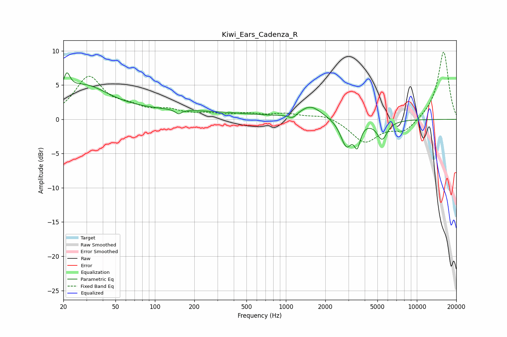

# Kiwi_Ears_Cadenza_R
See [usage instructions](https://github.com/jaakkopasanen/AutoEq#usage) for more options and info.

### Parametric EQs
Apply preamp of -6.9 dB when using parametric equalizer.

|   # | Type    |   Fc (Hz) |    Q |   Gain (dB) |
|-----|---------|-----------|------|-------------|
|   1 | Peaking |        21 | 5.63 |         2.7 |
|   2 | Peaking |        28 | 0.72 |         4.6 |
|   3 | Peaking |       151 | 6    |        -0.6 |
|   4 | Peaking |       170 | 0.28 |         1.1 |
|   5 | Peaking |      1124 | 4.44 |        -0.7 |
|   6 | Peaking |      1545 | 1.73 |         1.9 |
|   7 | Peaking |      2821 | 3.28 |        -2.6 |
|   8 | Peaking |      2974 | 4.83 |        -1.3 |
|   9 | Peaking |      3502 | 5.84 |        -3.1 |
|  10 | Peaking |      5427 | 3.52 |        -2.7 |

### Fixed Band EQs
When using fixed band (also called graphic) equalizer, apply preamp of **-9.9 dB** (if available) and set gains manually with these parameters.

|   # | Type    |   Fc (Hz) |    Q |   Gain (dB) |
|-----|---------|-----------|------|-------------|
|   1 | Peaking |        31 | 1.41 |         6   |
|   2 | Peaking |        62 | 1.41 |         1.3 |
|   3 | Peaking |       125 | 1.41 |         1.1 |
|   4 | Peaking |       250 | 1.41 |         0.6 |
|   5 | Peaking |       500 | 1.41 |         0.7 |
|   6 | Peaking |      1000 | 1.41 |         0.7 |
|   7 | Peaking |      2000 | 1.41 |         0.7 |
|   8 | Peaking |      4000 | 1.41 |        -3.3 |
|   9 | Peaking |      8000 | 1.41 |        -1.8 |
|  10 | Peaking |     16000 | 1.41 |        10   |

### Graphs

