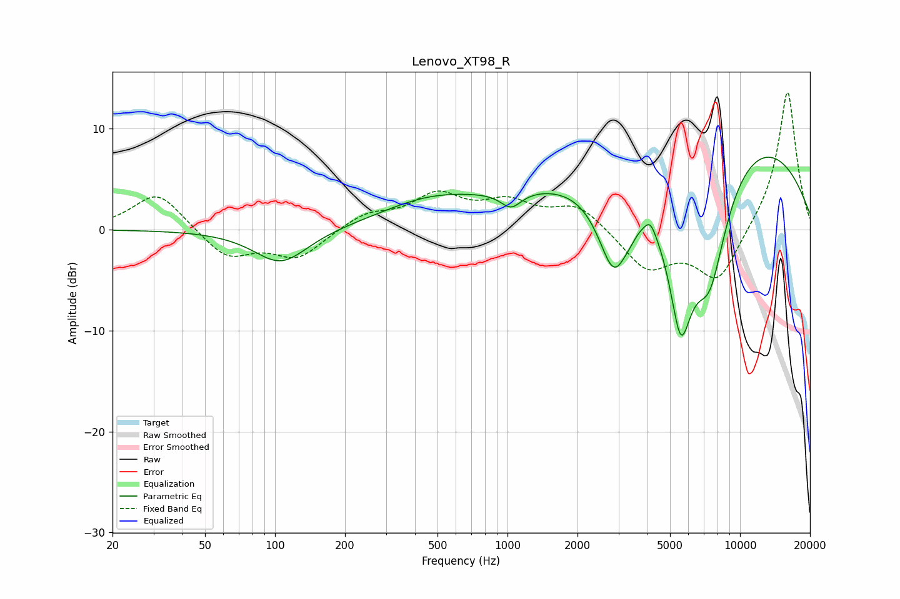

# Lenovo_XT98_R
See [usage instructions](https://github.com/jaakkopasanen/AutoEq#usage) for more options and info.

### Parametric EQs
Apply preamp of -7.3 dB when using parametric equalizer.

|   # | Type    |   Fc (Hz) |    Q |   Gain (dB) |
|-----|---------|-----------|------|-------------|
|   1 | Peaking |       106 | 1.22 |        -3.4 |
|   2 | Peaking |       448 | 0.68 |         2   |
|   3 | Peaking |      1036 | 3.17 |        -1.6 |
|   4 | Peaking |      2763 | 0.33 |        -4.5 |
|   5 | Peaking |      2875 | 1.92 |        -9.2 |
|   6 | Peaking |      3360 | 5.59 |        -0.4 |
|   7 | Peaking |      4112 | 5.77 |         1.2 |
|   8 | Peaking |      5518 | 0.19 |        13.7 |
|   9 | Peaking |      5559 | 2.27 |       -14.1 |
|  10 | Peaking |      7410 | 1.57 |       -11.7 |

### Fixed Band EQs
When using fixed band (also called graphic) equalizer, apply preamp of **-13.7 dB** (if available) and set gains manually with these parameters.

|   # | Type    |   Fc (Hz) |    Q |   Gain (dB) |
|-----|---------|-----------|------|-------------|
|   1 | Peaking |        31 | 1.41 |         3.8 |
|   2 | Peaking |        62 | 1.41 |        -2.8 |
|   3 | Peaking |       125 | 1.41 |        -2.8 |
|   4 | Peaking |       250 | 1.41 |         1.5 |
|   5 | Peaking |       500 | 1.41 |         3.2 |
|   6 | Peaking |      1000 | 1.41 |         2.4 |
|   7 | Peaking |      2000 | 1.41 |         2.4 |
|   8 | Peaking |      4000 | 1.41 |        -3.9 |
|   9 | Peaking |      8000 | 1.41 |        -5.2 |
|  10 | Peaking |     16000 | 1.41 |        14   |

### Graphs

