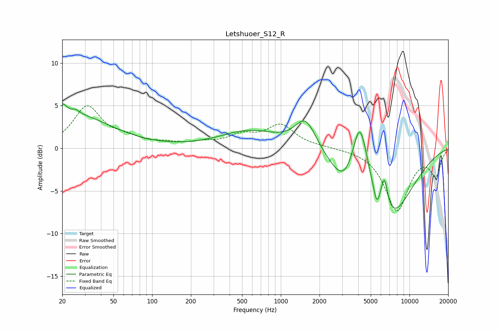

# Letshuoer_S12_R
See [usage instructions](https://github.com/jaakkopasanen/AutoEq#usage) for more options and info.

### Parametric EQs
Apply preamp of -5.3 dB when using parametric equalizer.

|   # | Type    |   Fc (Hz) |    Q |   Gain (dB) |
|-----|---------|-----------|------|-------------|
|   1 | Peaking |        20 | 4.83 |         1.1 |
|   2 | Peaking |        22 | 0.45 |         4.1 |
|   3 | Peaking |        25 | 5.93 |         0.4 |
|   4 | Peaking |       572 | 0.63 |         2   |
|   5 | Peaking |      1560 | 1.71 |         3.6 |
|   6 | Peaking |      3208 | 1.31 |        -3.8 |
|   7 | Peaking |      4111 | 2.13 |         8.8 |
|   8 | Peaking |      5570 | 6    |        -1.8 |
|   9 | Peaking |      6377 | 4.92 |         3.9 |
|  10 | Peaking |      6870 | 0.74 |        -8.5 |

### Fixed Band EQs
When using fixed band (also called graphic) equalizer, apply preamp of **-5.1 dB** (if available) and set gains manually with these parameters.

|   # | Type    |   Fc (Hz) |    Q |   Gain (dB) |
|-----|---------|-----------|------|-------------|
|   1 | Peaking |        31 | 1.41 |         4.8 |
|   2 | Peaking |        62 | 1.41 |         1   |
|   3 | Peaking |       125 | 1.41 |         0.4 |
|   4 | Peaking |       250 | 1.41 |         0.5 |
|   5 | Peaking |       500 | 1.41 |         1.3 |
|   6 | Peaking |      1000 | 1.41 |         2.6 |
|   7 | Peaking |      2000 | 1.41 |         0.1 |
|   8 | Peaking |      4000 | 1.41 |        -0   |
|   9 | Peaking |      8000 | 1.41 |        -7.2 |
|  10 | Peaking |     16000 | 1.41 |        -3   |

### Graphs

