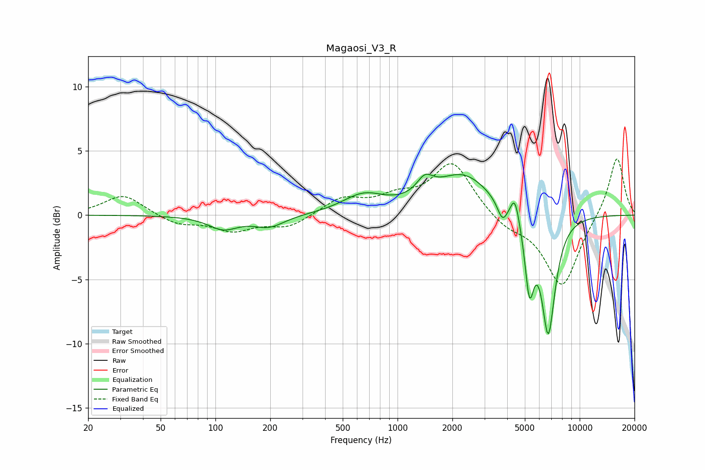

# Magaosi_V3_R
See [usage instructions](https://github.com/jaakkopasanen/AutoEq#usage) for more options and info.

### Parametric EQs
Apply preamp of -3.3 dB when using parametric equalizer.

|   # | Type    |   Fc (Hz) |    Q |   Gain (dB) |
|-----|---------|-----------|------|-------------|
|   1 | Peaking |       110 | 1.74 |        -1   |
|   2 | Peaking |       197 | 1.68 |        -0.9 |
|   3 | Peaking |       649 | 1.24 |         1.4 |
|   4 | Peaking |      1413 | 3.19 |         1.3 |
|   5 | Peaking |      2287 | 0.91 |         3.1 |
|   6 | Peaking |      3768 | 5.02 |        -1.4 |
|   7 | Peaking |      4409 | 6    |         1.8 |
|   8 | Peaking |      5298 | 5.61 |        -5.3 |
|   9 | Peaking |      6752 | 3.6  |        -9.8 |
|  10 | Peaking |      6922 | 6    |         0.8 |

### Fixed Band EQs
When using fixed band (also called graphic) equalizer, apply preamp of **-4.5 dB** (if available) and set gains manually with these parameters.

|   # | Type    |   Fc (Hz) |    Q |   Gain (dB) |
|-----|---------|-----------|------|-------------|
|   1 | Peaking |        31 | 1.41 |         1.6 |
|   2 | Peaking |        62 | 1.41 |        -0.7 |
|   3 | Peaking |       125 | 1.41 |        -1.1 |
|   4 | Peaking |       250 | 1.41 |        -0.9 |
|   5 | Peaking |       500 | 1.41 |         1.3 |
|   6 | Peaking |      1000 | 1.41 |         1.1 |
|   7 | Peaking |      2000 | 1.41 |         4.1 |
|   8 | Peaking |      4000 | 1.41 |        -0.9 |
|   9 | Peaking |      8000 | 1.41 |        -5.6 |
|  10 | Peaking |     16000 | 1.41 |         4.7 |

### Graphs

