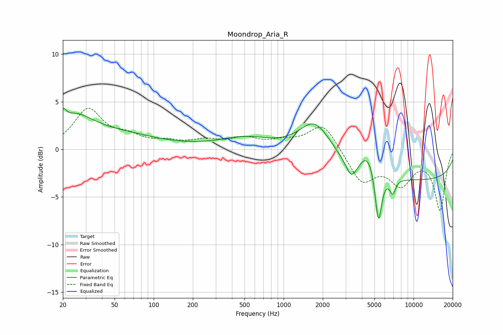

# Moondrop_Aria_R
See [usage instructions](https://github.com/jaakkopasanen/AutoEq#usage) for more options and info.

### Parametric EQs
Apply preamp of -4.4 dB when using parametric equalizer.

|   # | Type    |   Fc (Hz) |    Q |   Gain (dB) |
|-----|---------|-----------|------|-------------|
|   1 | Peaking |        20 | 5.76 |         1.3 |
|   2 | Peaking |        25 | 1.17 |         1.9 |
|   3 | Peaking |        37 | 0.35 |         1.8 |
|   4 | Peaking |       507 | 0.7  |         1.2 |
|   5 | Peaking |      1747 | 1.16 |         3.7 |
|   6 | Peaking |      3322 | 3.39 |        -1.8 |
|   7 | Peaking |      4451 | 2.33 |         2.2 |
|   8 | Peaking |      5366 | 5.52 |        -5.5 |
|   9 | Peaking |      6903 | 5.95 |        -1.6 |
|  10 | Peaking |     10000 | 0.18 |        -3.2 |

### Fixed Band EQs
When using fixed band (also called graphic) equalizer, apply preamp of **-4.4 dB** (if available) and set gains manually with these parameters.

|   # | Type    |   Fc (Hz) |    Q |   Gain (dB) |
|-----|---------|-----------|------|-------------|
|   1 | Peaking |        31 | 1.41 |         4.1 |
|   2 | Peaking |        62 | 1.41 |         1.1 |
|   3 | Peaking |       125 | 1.41 |         0.6 |
|   4 | Peaking |       250 | 1.41 |         0.8 |
|   5 | Peaking |       500 | 1.41 |         1   |
|   6 | Peaking |      1000 | 1.41 |         0.7 |
|   7 | Peaking |      2000 | 1.41 |         2.8 |
|   8 | Peaking |      4000 | 1.41 |        -3.4 |
|   9 | Peaking |      8000 | 1.41 |        -3.3 |
|  10 | Peaking |     16000 | 1.41 |        -6.3 |

### Graphs

