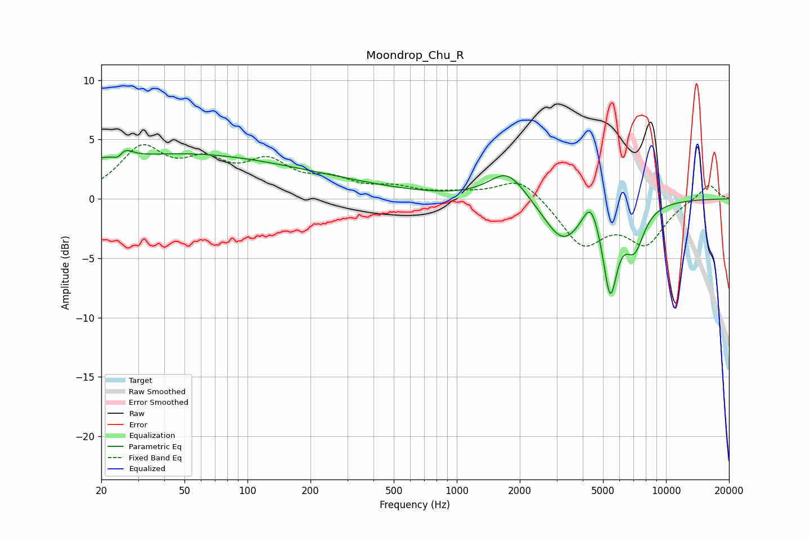

# Moondrop_Chu_R
See [usage instructions](https://github.com/jaakkopasanen/AutoEq#usage) for more options and info.

### Parametric EQs
Apply preamp of -4.2 dB when using parametric equalizer.

|   # | Type    |   Fc (Hz) |    Q |   Gain (dB) |
|-----|---------|-----------|------|-------------|
|   1 | Peaking |        24 | 4.54 |        -3.2 |
|   2 | Peaking |        25 | 4.03 |         3.4 |
|   3 | Peaking |        28 | 1.03 |        -0.3 |
|   4 | Peaking |        33 | 0.26 |         3.7 |
|   5 | Peaking |       205 | 0.4  |         1.3 |
|   6 | Peaking |      1748 | 1.6  |         2.5 |
|   7 | Peaking |      3213 | 1.53 |        -3.6 |
|   8 | Peaking |      4362 | 3.66 |         2.3 |
|   9 | Peaking |      5411 | 4.08 |        -7   |
|  10 | Peaking |      7066 | 2.85 |        -3.4 |

### Fixed Band EQs
When using fixed band (also called graphic) equalizer, apply preamp of **-4.7 dB** (if available) and set gains manually with these parameters.

|   # | Type    |   Fc (Hz) |    Q |   Gain (dB) |
|-----|---------|-----------|------|-------------|
|   1 | Peaking |        31 | 1.41 |         4   |
|   2 | Peaking |        62 | 1.41 |         2.5 |
|   3 | Peaking |       125 | 1.41 |         2.7 |
|   4 | Peaking |       250 | 1.41 |         1.3 |
|   5 | Peaking |       500 | 1.41 |         0.8 |
|   6 | Peaking |      1000 | 1.41 |         0.3 |
|   7 | Peaking |      2000 | 1.41 |         1.9 |
|   8 | Peaking |      4000 | 1.41 |        -3.8 |
|   9 | Peaking |      8000 | 1.41 |        -3.5 |
|  10 | Peaking |     16000 | 1.41 |         1.3 |

### Graphs

