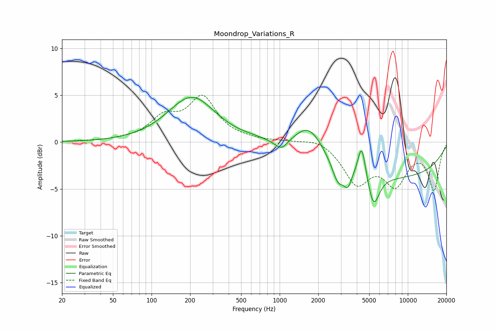

# Moondrop_Variations_R
See [usage instructions](https://github.com/jaakkopasanen/AutoEq#usage) for more options and info.

### Parametric EQs
Apply preamp of -4.9 dB when using parametric equalizer.

|   # | Type    |   Fc (Hz) |    Q |   Gain (dB) |
|-----|---------|-----------|------|-------------|
|   1 | Peaking |       200 | 1.5  |        -0.1 |
|   2 | Peaking |       206 | 0.79 |         4.9 |
|   3 | Peaking |       657 | 1.17 |         0.4 |
|   4 | Peaking |      1030 | 2.99 |        -1   |
|   5 | Peaking |      1692 | 1.14 |         4   |
|   6 | Peaking |      2855 | 3.15 |        -2.1 |
|   7 | Peaking |      3404 | 4.81 |        -1.6 |
|   8 | Peaking |      4367 | 4.57 |         3.8 |
|   9 | Peaking |      5403 | 3.17 |        -3.4 |
|  10 | Peaking |      6134 | 0.18 |        -3.8 |

### Fixed Band EQs
When using fixed band (also called graphic) equalizer, apply preamp of **-5.1 dB** (if available) and set gains manually with these parameters.

|   # | Type    |   Fc (Hz) |    Q |   Gain (dB) |
|-----|---------|-----------|------|-------------|
|   1 | Peaking |        31 | 1.41 |         0.1 |
|   2 | Peaking |        62 | 1.41 |         0.2 |
|   3 | Peaking |       125 | 1.41 |         2.3 |
|   4 | Peaking |       250 | 1.41 |         4.5 |
|   5 | Peaking |       500 | 1.41 |         0.2 |
|   6 | Peaking |      1000 | 1.41 |         0.1 |
|   7 | Peaking |      2000 | 1.41 |         0.6 |
|   8 | Peaking |      4000 | 1.41 |        -4.1 |
|   9 | Peaking |      8000 | 1.41 |        -4.1 |
|  10 | Peaking |     16000 | 1.41 |        -5   |

### Graphs

