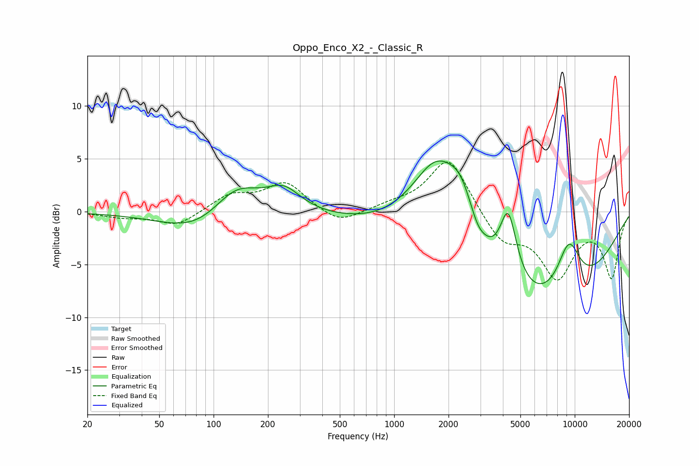

# Oppo_Enco_X2_-_Classic_R
See [usage instructions](https://github.com/jaakkopasanen/AutoEq#usage) for more options and info.

### Parametric EQs
Apply preamp of -4.9 dB when using parametric equalizer.

|   # | Type    |   Fc (Hz) |    Q |   Gain (dB) |
|-----|---------|-----------|------|-------------|
|   1 | Peaking |        86 | 0.69 |        -2.4 |
|   2 | Peaking |       132 | 1.05 |         3.4 |
|   3 | Peaking |       245 | 1.5  |         2.1 |
|   4 | Peaking |      1728 | 0.86 |         9.9 |
|   5 | Peaking |      2360 | 1.81 |         3.8 |
|   6 | Peaking |      2884 | 3.82 |        -0.7 |
|   7 | Peaking |      3353 | 0.18 |        -3   |
|   8 | Peaking |      4283 | 2.93 |         6.6 |
|   9 | Peaking |      5590 | 0.27 |        -7.3 |
|  10 | Peaking |      9271 | 1.92 |         5   |

### Fixed Band EQs
When using fixed band (also called graphic) equalizer, apply preamp of **-4.8 dB** (if available) and set gains manually with these parameters.

|   # | Type    |   Fc (Hz) |    Q |   Gain (dB) |
|-----|---------|-----------|------|-------------|
|   1 | Peaking |        31 | 1.41 |        -0.5 |
|   2 | Peaking |        62 | 1.41 |        -1.4 |
|   3 | Peaking |       125 | 1.41 |         1.5 |
|   4 | Peaking |       250 | 1.41 |         2.7 |
|   5 | Peaking |       500 | 1.41 |        -1.3 |
|   6 | Peaking |      1000 | 1.41 |         0.5 |
|   7 | Peaking |      2000 | 1.41 |         5.3 |
|   8 | Peaking |      4000 | 1.41 |        -2.8 |
|   9 | Peaking |      8000 | 1.41 |        -5.9 |
|  10 | Peaking |     16000 | 1.41 |        -6.1 |

### Graphs

