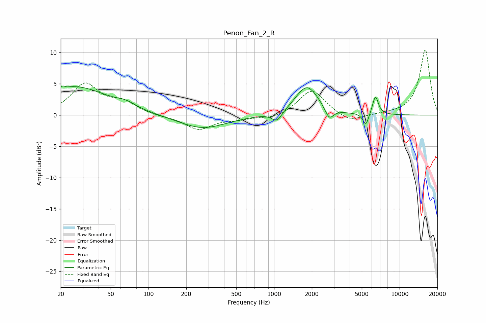

# Penon_Fan_2_R
See [usage instructions](https://github.com/jaakkopasanen/AutoEq#usage) for more options and info.

### Parametric EQs
Apply preamp of -4.8 dB when using parametric equalizer.

|   # | Type    |   Fc (Hz) |    Q |   Gain (dB) |
|-----|---------|-----------|------|-------------|
|   1 | Peaking |        21 | 5.94 |         3.2 |
|   2 | Peaking |        21 | 5.96 |        -2.9 |
|   3 | Peaking |        25 | 0.52 |         4.5 |
|   4 | Peaking |        66 | 1.93 |         0.7 |
|   5 | Peaking |       269 | 0.75 |        -2.2 |
|   6 | Peaking |      1057 | 3.44 |        -1.6 |
|   7 | Peaking |      1827 | 1.55 |         4.7 |
|   8 | Peaking |      2751 | 4.17 |        -1.9 |
|   9 | Peaking |      5385 | 6    |        -2   |
|  10 | Peaking |      6417 | 5.85 |         3   |

### Fixed Band EQs
When using fixed band (also called graphic) equalizer, apply preamp of **-10.5 dB** (if available) and set gains manually with these parameters.

|   # | Type    |   Fc (Hz) |    Q |   Gain (dB) |
|-----|---------|-----------|------|-------------|
|   1 | Peaking |        31 | 1.41 |         4.8 |
|   2 | Peaking |        62 | 1.41 |         1.8 |
|   3 | Peaking |       125 | 1.41 |        -0.2 |
|   4 | Peaking |       250 | 1.41 |        -2.3 |
|   5 | Peaking |       500 | 1.41 |        -0.6 |
|   6 | Peaking |      1000 | 1.41 |        -0.7 |
|   7 | Peaking |      2000 | 1.41 |         4.2 |
|   8 | Peaking |      4000 | 1.41 |        -1.3 |
|   9 | Peaking |      8000 | 1.41 |         0.1 |
|  10 | Peaking |     16000 | 1.41 |        10.5 |

### Graphs

