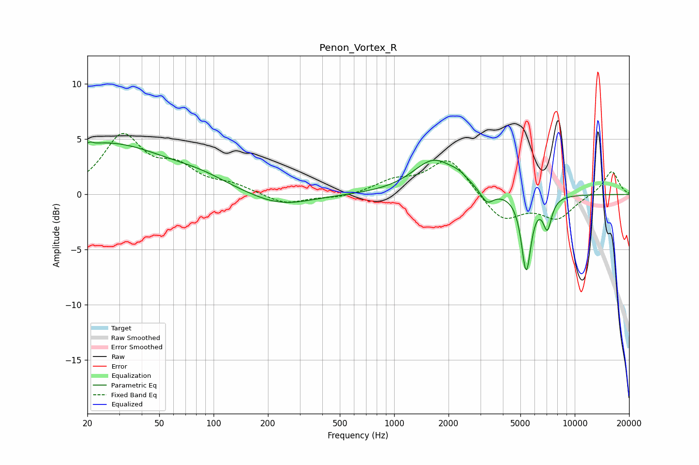

# Penon_Vortex_R
See [usage instructions](https://github.com/jaakkopasanen/AutoEq#usage) for more options and info.

### Parametric EQs
Apply preamp of -4.8 dB when using parametric equalizer.

|   # | Type    |   Fc (Hz) |    Q |   Gain (dB) |
|-----|---------|-----------|------|-------------|
|   1 | Peaking |        21 | 5.88 |         3.1 |
|   2 | Peaking |        21 | 5.99 |        -2.9 |
|   3 | Peaking |        25 | 0.4  |         4.6 |
|   4 | Peaking |        86 | 0.96 |         0.7 |
|   5 | Peaking |       233 | 0.83 |        -1.2 |
|   6 | Peaking |      1658 | 1.21 |         3.1 |
|   7 | Peaking |      2292 | 2.74 |         0.6 |
|   8 | Peaking |      3267 | 3.92 |        -1.2 |
|   9 | Peaking |      5386 | 5.28 |        -6.8 |
|  10 | Peaking |      7053 | 5.71 |        -2.7 |

### Fixed Band EQs
When using fixed band (also called graphic) equalizer, apply preamp of **-5.6 dB** (if available) and set gains manually with these parameters.

|   # | Type    |   Fc (Hz) |    Q |   Gain (dB) |
|-----|---------|-----------|------|-------------|
|   1 | Peaking |        31 | 1.41 |         5.1 |
|   2 | Peaking |        62 | 1.41 |         2.1 |
|   3 | Peaking |       125 | 1.41 |         0.7 |
|   4 | Peaking |       250 | 1.41 |        -0.9 |
|   5 | Peaking |       500 | 1.41 |        -0.3 |
|   6 | Peaking |      1000 | 1.41 |         1.1 |
|   7 | Peaking |      2000 | 1.41 |         3.3 |
|   8 | Peaking |      4000 | 1.41 |        -2.4 |
|   9 | Peaking |      8000 | 1.41 |        -2.1 |
|  10 | Peaking |     16000 | 1.41 |         2.2 |

### Graphs

