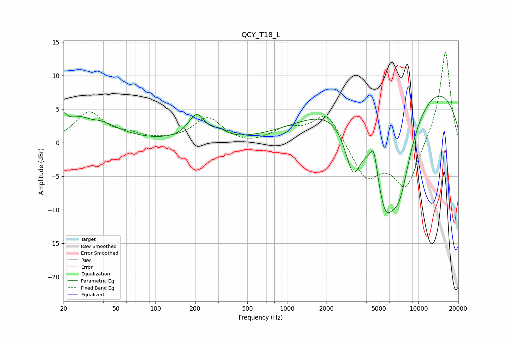

# QCY_T18_L
See [usage instructions](https://github.com/jaakkopasanen/AutoEq#usage) for more options and info.

### Parametric EQs
Apply preamp of -7.0 dB when using parametric equalizer.

|   # | Type    |   Fc (Hz) |    Q |   Gain (dB) |
|-----|---------|-----------|------|-------------|
|   1 | Peaking |        20 | 5.83 |         1.6 |
|   2 | Peaking |        30 | 0.83 |         4.4 |
|   3 | Peaking |        32 | 2.4  |        -0.8 |
|   4 | Peaking |       206 | 2.2  |         3.8 |
|   5 | Peaking |       309 | 2.88 |         0.9 |
|   6 | Peaking |      3182 | 2.1  |        -8.6 |
|   7 | Peaking |      4569 | 5.47 |         3.5 |
|   8 | Peaking |      5545 | 1.7  |       -11   |
|   9 | Peaking |      7149 | 1.15 |       -14.1 |
|  10 | Peaking |      7835 | 0.2  |        11.4 |

### Fixed Band EQs
When using fixed band (also called graphic) equalizer, apply preamp of **-13.6 dB** (if available) and set gains manually with these parameters.

|   # | Type    |   Fc (Hz) |    Q |   Gain (dB) |
|-----|---------|-----------|------|-------------|
|   1 | Peaking |        31 | 1.41 |         4.4 |
|   2 | Peaking |        62 | 1.41 |         0.9 |
|   3 | Peaking |       125 | 1.41 |         0.1 |
|   4 | Peaking |       250 | 1.41 |         3.6 |
|   5 | Peaking |       500 | 1.41 |        -0.5 |
|   6 | Peaking |      1000 | 1.41 |         1.9 |
|   7 | Peaking |      2000 | 1.41 |         4.6 |
|   8 | Peaking |      4000 | 1.41 |        -5.3 |
|   9 | Peaking |      8000 | 1.41 |        -6.9 |
|  10 | Peaking |     16000 | 1.41 |        14   |

### Graphs

