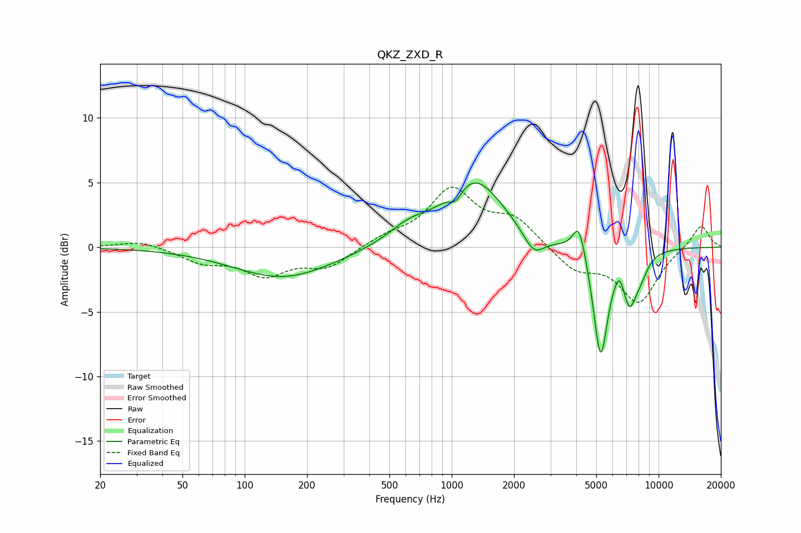

# QKZ_ZXD_R
See [usage instructions](https://github.com/jaakkopasanen/AutoEq#usage) for more options and info.

### Parametric EQs
Apply preamp of -5.1 dB when using parametric equalizer.

|   # | Type    |   Fc (Hz) |    Q |   Gain (dB) |
|-----|---------|-----------|------|-------------|
|   1 | Peaking |       154 | 0.59 |        -2.4 |
|   2 | Peaking |       614 | 1.42 |         1.1 |
|   3 | Peaking |      1047 | 4.54 |        -1   |
|   4 | Peaking |      1280 | 0.99 |         5.2 |
|   5 | Peaking |      2495 | 2.77 |        -1.7 |
|   6 | Peaking |      4125 | 4.62 |         2.6 |
|   7 | Peaking |      5244 | 3.96 |        -8.4 |
|   8 | Peaking |      6473 | 6    |         1.1 |
|   9 | Peaking |      7235 | 3.84 |        -3.6 |
|  10 | Peaking |      8201 | 3.63 |        -1.2 |

### Fixed Band EQs
When using fixed band (also called graphic) equalizer, apply preamp of **-4.7 dB** (if available) and set gains manually with these parameters.

|   # | Type    |   Fc (Hz) |    Q |   Gain (dB) |
|-----|---------|-----------|------|-------------|
|   1 | Peaking |        31 | 1.41 |         0.5 |
|   2 | Peaking |        62 | 1.41 |        -1   |
|   3 | Peaking |       125 | 1.41 |        -2   |
|   4 | Peaking |       250 | 1.41 |        -1.5 |
|   5 | Peaking |       500 | 1.41 |         0.7 |
|   6 | Peaking |      1000 | 1.41 |         4.3 |
|   7 | Peaking |      2000 | 1.41 |         2   |
|   8 | Peaking |      4000 | 1.41 |        -1.7 |
|   9 | Peaking |      8000 | 1.41 |        -4.2 |
|  10 | Peaking |     16000 | 1.41 |         1.8 |

### Graphs

