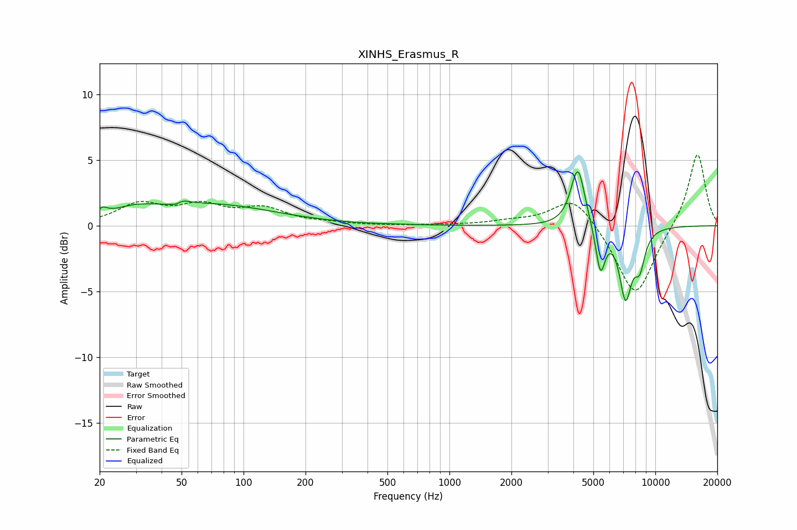

# XINHS_Erasmus_R
See [usage instructions](https://github.com/jaakkopasanen/AutoEq#usage) for more options and info.

### Parametric EQs
Apply preamp of -4.2 dB when using parametric equalizer.

|   # | Type    |   Fc (Hz) |    Q |   Gain (dB) |
|-----|---------|-----------|------|-------------|
|   1 | Peaking |        21 | 5.56 |         0.5 |
|   2 | Peaking |        29 | 1.34 |         0.7 |
|   3 | Peaking |        48 | 4.27 |        -1.4 |
|   4 | Peaking |        49 | 4.07 |         1.6 |
|   5 | Peaking |        70 | 0.46 |         1.6 |
|   6 | Peaking |       550 | 3.55 |         0   |
|   7 | Peaking |      4208 | 4.12 |         4.6 |
|   8 | Peaking |      5412 | 6    |        -3.5 |
|   9 | Peaking |      7168 | 4.44 |        -5.1 |
|  10 | Peaking |      8396 | 5.02 |        -2.5 |

### Fixed Band EQs
When using fixed band (also called graphic) equalizer, apply preamp of **-5.5 dB** (if available) and set gains manually with these parameters.

|   # | Type    |   Fc (Hz) |    Q |   Gain (dB) |
|-----|---------|-----------|------|-------------|
|   1 | Peaking |        31 | 1.41 |         1.5 |
|   2 | Peaking |        62 | 1.41 |         1.3 |
|   3 | Peaking |       125 | 1.41 |         1.2 |
|   4 | Peaking |       250 | 1.41 |         0.1 |
|   5 | Peaking |       500 | 1.41 |        -0   |
|   6 | Peaking |      1000 | 1.41 |         0   |
|   7 | Peaking |      2000 | 1.41 |         0.3 |
|   8 | Peaking |      4000 | 1.41 |         2.4 |
|   9 | Peaking |      8000 | 1.41 |        -5.5 |
|  10 | Peaking |     16000 | 1.41 |         5.7 |

### Graphs

