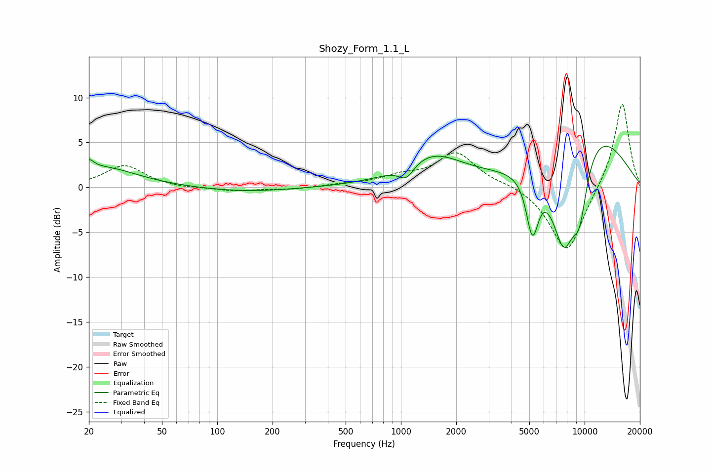

# Shozy_Form_1.1_L
See [usage instructions](https://github.com/jaakkopasanen/AutoEq#usage) for more options and info.

### Parametric EQs
Apply preamp of -4.7 dB when using parametric equalizer.

|   # | Type    |   Fc (Hz) |    Q |   Gain (dB) |
|-----|---------|-----------|------|-------------|
|   1 | Peaking |        20 | 5.25 |         1.1 |
|   2 | Peaking |        24 | 0.75 |         2.2 |
|   3 | Peaking |       141 | 0.57 |        -0.5 |
|   4 | Peaking |      1069 | 3.38 |        -1.6 |
|   5 | Peaking |      1474 | 0.85 |         3.4 |
|   6 | Peaking |      5151 | 4.22 |        -4.7 |
|   7 | Peaking |      5311 | 4.58 |        -1.7 |
|   8 | Peaking |      7706 | 1.69 |       -11.7 |
|   9 | Peaking |      9395 | 2.87 |        -5.9 |
|  10 | Peaking |     10000 | 0.5  |         8.1 |

### Fixed Band EQs
When using fixed band (also called graphic) equalizer, apply preamp of **-9.3 dB** (if available) and set gains manually with these parameters.

|   # | Type    |   Fc (Hz) |    Q |   Gain (dB) |
|-----|---------|-----------|------|-------------|
|   1 | Peaking |        31 | 1.41 |         2.4 |
|   2 | Peaking |        62 | 1.41 |        -0.2 |
|   3 | Peaking |       125 | 1.41 |        -0.4 |
|   4 | Peaking |       250 | 1.41 |        -0.2 |
|   5 | Peaking |       500 | 1.41 |         0.3 |
|   6 | Peaking |      1000 | 1.41 |         1   |
|   7 | Peaking |      2000 | 1.41 |         3.8 |
|   8 | Peaking |      4000 | 1.41 |         0.4 |
|   9 | Peaking |      8000 | 1.41 |        -7.5 |
|  10 | Peaking |     16000 | 1.41 |         9.7 |

### Graphs

