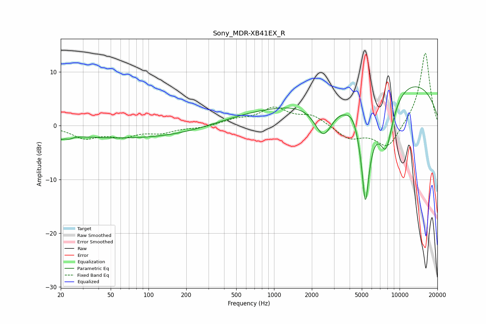

# Sony_MDR-XB41EX_R
See [usage instructions](https://github.com/jaakkopasanen/AutoEq#usage) for more options and info.

### Parametric EQs
Apply preamp of -7.3 dB when using parametric equalizer.

|   # | Type    |   Fc (Hz) |    Q |   Gain (dB) |
|-----|---------|-----------|------|-------------|
|   1 | Peaking |        20 | 5.67 |        -0.8 |
|   2 | Peaking |        23 | 4.86 |        -0.6 |
|   3 | Peaking |        82 | 0.19 |        -2.4 |
|   4 | Peaking |      1004 | 0.28 |         3   |
|   5 | Peaking |      2478 | 1.89 |        -6.6 |
|   6 | Peaking |      4296 | 3.5  |         1.3 |
|   7 | Peaking |      5343 | 3.39 |       -20   |
|   8 | Peaking |      7796 | 2.18 |       -10.2 |
|   9 | Peaking |      9639 | 0.26 |         7.1 |
|  10 | Peaking |      9767 | 0.18 |         1.8 |

### Fixed Band EQs
When using fixed band (also called graphic) equalizer, apply preamp of **-13.6 dB** (if available) and set gains manually with these parameters.

|   # | Type    |   Fc (Hz) |    Q |   Gain (dB) |
|-----|---------|-----------|------|-------------|
|   1 | Peaking |        31 | 1.41 |        -2.2 |
|   2 | Peaking |        62 | 1.41 |        -1.7 |
|   3 | Peaking |       125 | 1.41 |        -1.1 |
|   4 | Peaking |       250 | 1.41 |        -0.4 |
|   5 | Peaking |       500 | 1.41 |         1   |
|   6 | Peaking |      1000 | 1.41 |         3.1 |
|   7 | Peaking |      2000 | 1.41 |         1.8 |
|   8 | Peaking |      4000 | 1.41 |        -2.4 |
|   9 | Peaking |      8000 | 1.41 |        -4.3 |
|  10 | Peaking |     16000 | 1.41 |        13.8 |

### Graphs

